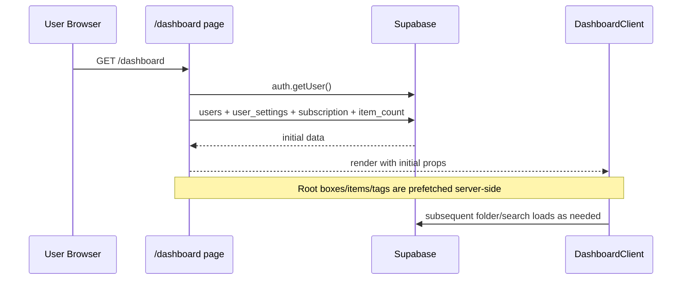
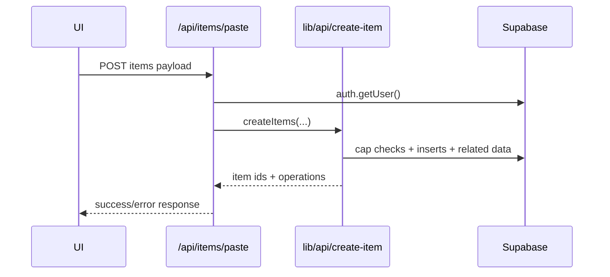
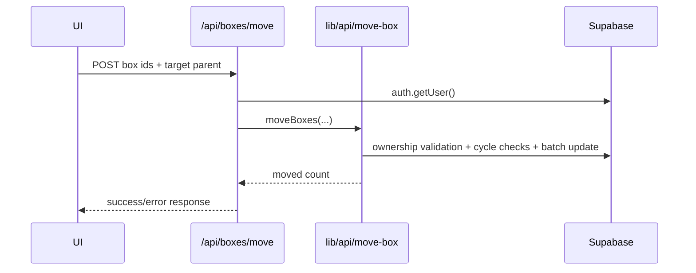

# ShrineKeep Architecture

This document captures the current system shape and the intended abstraction boundaries for maintainable growth.

## High-level structure

- **App layer**: Next.js routes and route handlers under `app/`.
- **Feature/UI layer**: components and hooks under `components/` and `lib/hooks/`.
- **Domain layer**: business operations under `lib/api/`.
- **Infra layer**: Supabase clients and external integrations under `lib/supabase/`, `lib/monitoring/`, and API routes.

## Runtime boundaries

- Route handlers (`app/api/*`) should:
  - authenticate user,
  - parse request body,
  - call domain/service module,
  - map domain errors to HTTP responses.
- Domain modules (`lib/api/*`) and service modules (`lib/services/*`) should:
  - contain business invariants (ownership, cap checks, move/cycle rules),
  - remain framework-agnostic where possible.
- UI components should:
  - orchestrate view state and event handlers,
  - avoid embedding database/business rules directly.

## Core request flows

### Dashboard bootstrap

### Paste item creation

### Box move validation

## Scaling guidelines

- Keep route handlers thin and deterministic.
- Prefer explicit service functions over inline query logic in page/components.
- Introduce feature hooks for large client containers:
  - `useDashboardData`,
  - `useDashboardDnD`,
  - `useDashboardDialogs`.
- Add performance instrumentation around high-frequency API routes before large refactors.
- Use query-keyed client caching (TanStack Query) for dashboard collections:
  - boxes by `parent_box_id`,
  - items by `box_id + searchQuery`,
  - unacquired wishlist items by `wishlist_target_box_id`,
  - tags by `user_id`.
