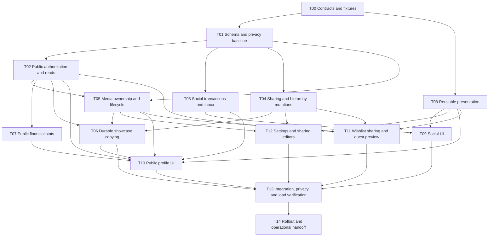

# Public profiles, showcase boxes, friendships, and wishlist privacy

Implementation plan · 2026-09-07

Status: ready to split into implementation tasks. This document specifies future work; it does not claim that migrations, security fixes, workers, or UI changes have been implemented or deployed. Repository findings describe the checked-in working tree, not a verified production database.

Reading paths: [agreed requirements](#11-agreed-product-requirements), [architecture](#3-architecture-and-trust-boundaries), [wishlist privacy and preview](#6-independent-wishlist-privacy), [copy workflow](#11-copy-to-own-dashboard-workflow), [migration strategy](#13-migration-and-compatibility-strategy), [agent tasks](#14-agent-task-breakdown), and [verification gates](#15-verification-matrix-and-release-gates).

## 1. Outcome and scope

Add a small social layer to ShrineKeep: public profiles, friendships, blocks, public/friends-only showcase boxes, independent wishlist sharing, and copying a showcase into one's own dashboard. Preserve the current collection-management UI and financial calculations wherever their behavior remains appropriate after privacy filtering.

Use the existing Next.js application and Supabase/Postgres deployment. Keep feature modules separate inside this application. A graph database, microservices, feeds, followers, likes, comments, recommendations, public friend lists, global nickname search, custom handles, and chat are out of scope. Future chat should be able to reuse stable user IDs and relationship/block checks without requiring a redesign of those concepts.

### 1.1 Agreed product requirements

| ID | Requirement |
|---|---|
| R01 | Add Social to the navigation bar. Include Friendships and a notifications/request inbox. |
| R02 | Friends are searchable and scrollable, fetched in pages of 20, with no more than 20 friend rows rendered at a time. Do not load a user's whole friend list to search it. |
| R03 | Selecting a friend opens their profile. Right-click and an accessible menu expose Unfriend and Block. Include blocked-user management and Unblock. |
| R04 | Requests and acceptances produce in-app notifications. Support accept, decline, cancel, unfriend, block, and unblock. No chat or notification emails are added. |
| R05 | Profile URLs use the existing user UUID, under `/users/[userId]`. Guests may view public content. |
| R06 | Public identity consists of ID, explicitly chosen nickname, profile picture, and bio. Never expose email, authentication metadata, billing, or private settings. Nicknames need not be unique. |
| R07 | Owners get a settings/edit icon on their profile. Public pages retain navigation, including a path back to Dashboard for signed-in visitors. |
| R08 | Owner-shared theme takes precedence; otherwise use the visitor's theme, then the application default for a guest. Leaving the page restores the visitor's normal theme. |
| R09 | Profile tabs are Wishlist and Showcase boxes. Reuse existing grids, item details, wishlist presentation, and Box Stats with explicit read-only capabilities. |
| R10 | Box collection visibility is Private, Friends only, or Public. Collection financial sharing is an independent boolean. New root boxes start Private with finances hidden. |
| R11 | **Amended 2026-09-08.** A box's audience is a ceiling for its descendants in the same dimension: a child may be as narrow as it likes and never wider. This governs collection audience and wishlist audience independently, and does not govern `share_financials`. Restricting a parent clamps every wider descendant in one transaction; widening a parent changes no descendant. The editor states the direction-appropriate consequence and the count actually affected. Supersedes the original overwrite-all-descendants behaviour. See section 5.0. |
| R12 | **Amended 2026-09-08.** A visible box is a showcase root when its parent is the collection root. Visible direct children appear within their visible parent, not again at root. Because the ceiling in R11 makes the visible set ancestor-closed, a visible box can no longer have an invisible parent. |
| R13 | **Superseded 2026-09-08 by R11.** A private intermediate box with a visible descendant is now an unrepresentable state, so there is no private gap to split into two roots. Do not implement detached-root handling. Retained as a numbered row so the requirement map and existing references stay stable. |
| R25 | The collection root has the same three-audience control as a box. Loose owned items not filed in any box follow it, and because every top-level box is a child of the root, the root is the ceiling for the whole account: setting it Private hides everything. Added 2026-09-08; reverses the earlier "unboxed items stay private" rule in section 5.2. |
| R26 | Tags are out of scope for all public surfaces: no public response exposes tag names, colors, IDs, or counts, and no public surface offers tag filtering or sorting. Copying creates no tags for the copier; whether it ever should is deferred until after copy is implemented. Added 2026-09-08. |
| R27 | Deleting a box while keeping its contents moves them up one level, to the nearest ancestor that is not also being deleted, preserving nesting below. Contents adopt the destination's audience and may become more visible; the owner is warned before confirming and the operation is not otherwise restricted. Explicitly Private wishlist items are exempt. Added 2026-09-08; replaces the move-to-root behavior. |
| R14 | Wishlist visibility is independent of collection visibility. A private collection box may have public wishlist items. **Clarified 2026-09-08:** this independence is between the two dimensions, not within one. A box's wishlist audience is still ceilinged by its parent's wishlist audience under R11; it is simply unaffected by any box's collection audience. |
| R15 | In the box editor, collection Private/Friends only/Public suggests the matching wishlist audience before saving. The owner can change that suggestion. Reopening the editor preserves saved combinations. |
| R16 | An explicitly private wishlist item stays private regardless of box publicity, wishlist publicity, or parent propagation. |
| R17 | Profiles, existing wishlist links, public item/media reads, and copying apply the same wishlist privacy rules. An old link cannot bypass them. |
| R18 | Expected price may be shown for a visible wishlist item even when collection financial sharing is off. Owned-item acquisition cost/date, current value, and value history remain controlled by collection financial sharing. |
| R19 | Wishlist includes a “Preview public wishlist” toggle showing exactly what a signed-out visitor would see, using the actual guest filtering path. |
| R20 | “Copy to own dashboard” copies the permitted showcase subtree into the copier's root. Uploaded media gets independent objects under the copier's ownership; external links remain links. Copies start Private. |
| R21 | Blocking removes friendship and requests and denies the known signed-in account access to public identity/content. Guests remain allowed: blocking cannot identify someone after logout or through another account. |
| R22 | Add request rate limits, profile-link/UUID lookup, and menus usable by mouse, touch, and keyboard. Do not add a global user directory. |
| R23 | The wishlist share link is a permanent surface alongside the profile Wishlist tab. A user may share only their wishlist without publishing their collection, and a visitor may follow the link through to the owner's profile. Added 2026-09-08. |
| R24 | Wishlist items with no target box belong to a root container with its own audience. A single owner toggle governs whether the share link resolves and nothing else; there is no state in which a surface reports that a wishlist is unpublished. Added 2026-09-08. |

### 1.2 Implementation defaults that make the requirements concrete

These are engineering defaults, not additional unresolved product questions. Change them only with an explicit explanation of the impact on the requirements above.

- A new public profile has `nickname = NULL`; its public label is `Collector-<short UUID suffix>` until the user explicitly saves a public nickname. Suggest an existing name only inside their private Settings UI. Do not migrate provider-derived names into public nicknames automatically.
- Nicknames reuse the existing name-length limit; bio is plain text, at most 500 Unicode characters, with matching client/database validation. No HTML, Markdown, or automatic link previews in bio.
- A new child box inherits all three saved sharing settings from its parent. **Amended 2026-09-08:** moving an existing box preserves its saved settings only where they remain legal under the new parent's ceiling; anything wider than the destination parent is clamped to it. A move that would widen a box is not a way around section 5.0.
- Wishlist audience uses the same three audience values as collections. Individual wishlist items initially offer “Use box wishlist visibility” and “Private.”
- Wishlist items with no target box are associated with **root**, a container with its own audience, not an “account default.” Root uses the same three audience values and controls as a box. See the amended section 6.3.
- The retained “share my wishlist by link” toggle governs only whether `/wishlist/[token]` resolves. It never affects what any surface displays. See the amended section 6.3.
- A normal owner visit to their profile uses the published public-plus-friends presentation, without private collection rows or suppressed financial fields. Their ordinary Dashboard/Wishlist remains the editing surface. Public wishlist preview always uses the guest presentation.
- The other party must explicitly accept a request. Opposite-direction simultaneous requests do not silently establish friendship.
- Blocking denies ordinary profile/content access in both directions. The blocker can still manage the block by user ID in their private blocked-users list; that list does not bypass public-profile denial.
- Social notifications initially refresh on page focus and every 30 seconds while Social is visible. Persist them in the database; transport can later become Realtime without changing their storage or meaning.
- Newly issued media links have a maximum 60-second lifetime. New application reads deny revoked access immediately; previously issued bearer URLs, browser caches, downloaded files, and completed independent copies cannot be recalled.
- Share links are a permanent product surface, not a compatibility alias. `/wishlist/[token]` and the profile Wishlist tab are two intended entry points to the same projection, and a user may share only their wishlist without publishing their collection. A token is not an additional access grant, and rotating or disabling a token cannot make content private while it is publicly visible through a UUID profile.
- A visitor on a share link can follow through to the owner's profile, where both tabs are available. Profile tabs load independently: opening one tab must not fetch the other's data.

## 2. Current implementation and required adaptations

Read these files before changing the related area. Preserve unrelated work already present in the working tree.

| Area | Existing entry points | What can be reused / what must change |
|---|---|---|
| Schema | `supabase/schema.sql`, `supabase/migrations/` | Existing users, boxes, items, photos, value history, settings, and a basic friendship table. Replace the boolean collection-sharing model and directional friendship/status model through migrations. |
| Public identity | `components/settings/personal-settings.tsx`, `app/api/settings/route.ts`, signup trigger | Existing settings and avatar controls are useful. Signup currently copies provider names into `users.name`; separate public nickname publication from that field. |
| Public wishlist | `app/api/wishlist/[token]/route.ts`, `app/wishlist/[token]/page.tsx`, `public-wishlist-client.tsx` | Existing API selects full item/photo records and loads all wishlist items. Replace with paginated, explicit public projections. Server page currently makes a self-HTTP request without forwarding viewer context; replace with a direct shared service call. |
| Wishlist settings | `components/wishlist-sharing-panel.tsx`, `app/wishlist/wishlist-client.tsx`, `lib/settings.ts` | Evolve the blanket public switch into clearly labelled audience controls and add guest preview. Preserve token compatibility and existing editing functionality. |
| Collection UI | `components/box-grid.tsx`, `components/item-grid.tsx`, item detail components, dashboard client | Reuse display components and extract capabilities. Public pages must not mount owner data hooks or owner mutation paths. |
| Collection reads | `lib/hooks/use-dashboard-data.ts`, `lib/services/dashboard/load-dashboard-root.ts` | Owner-scoped loading remains useful for owners. Public loading needs different DTOs, visibility rules, pagination, and query keys. |
| Stats | `app/api/boxes/[boxId]/stats/route.ts`, `lib/hooks/use-box-stats.ts`, `components/box-stats-*.tsx` | Reuse chart/panel presentation and compatible calculation semantics. Current stats use repeated hierarchy queries, unbounded history loading, and query keys without viewer identity. |
| Copy/paste | `lib/api/copy-expand.ts`, `app/api/boxes/paste/route.ts`, `app/api/items/paste/route.ts`, atomic paste RPC migrations | Source expansion currently limits reads to the caller and reuses media paths. Preserve same-owner behavior; add an authorized cross-owner copy workflow with independent media. |
| Media lifecycle | `lib/api/photo-storage.ts`, `lib/api/delete-item.ts`, `lib/api/delete-box.ts`, photo/storage routes | Cleanup checks references within one owner's data, and some paths delete blobs before committing row deletion. Introduce coordinated reference and garbage-collection handling. |
| Avatars | `app/api/users/me/avatar/route.ts`, personal settings, avatar storage migration | Existing avatars are described as a public bucket and use a fixed path. Introduce private, immutable objects and an authorized public-media delivery path. |
| Navigation/themes | `components/app-nav.tsx`, `components/theme-provider.tsx`, `docs/DESIGN.md` | Extend navigation and centralize public theme resolution. Existing public wishlist falls back to app defaults rather than the signed-in visitor's theme. |
| Account lifecycle | `lib/judge/*`, `lib/moderation/*`, moderation and judge routes | Preserve sandbox restrictions. Hide deleted/suspended accounts, cancel unfinished copies, and integrate new media/job cleanup with deletion. |

### 2.1 Privacy baseline is a prerequisite

The checked-in schema includes a `Users can view public profiles` policy with `USING (true)` on `users`, which also contains email. It also permits public settings rows for public wishlists and raw item rows for public boxes/wishlists. A route selecting fewer fields does not remove alternate direct Data API access.

Before launch, inventory every grant, RLS policy, RPC, storage policy, view, GraphQL exposure, and public route. Remove broad read paths over account, settings, collection, photo, and financial tables. Confirm both the migration history and actual deployment; do not assume `schema.sql` alone describes production.

Supabase RLS filters rows, not individual fields. Public response projection and removal of raw cross-owner read grants/policies are both required. See [column-level security](https://supabase.com/docs/guides/database/postgres/column-level-security) and [RLS and grants](https://supabase.com/docs/guides/database/postgres/row-level-security).

## 3. Architecture and trust boundaries

### 3.1 Chosen approach

Use server endpoints/services for public and social operations, with narrow database functions implementing authorization and public projection. Existing owner tables remain accessible to their owner through appropriately restricted RLS where current UI needs it. Do not grant anonymous/authenticated clients general cross-owner SELECT on those tables.

Recommended module boundaries:

```text
lib/social/contracts.ts             DTOs, relationship states, cursor envelopes
lib/social/server/                  requests, friends, blocks, notification services
lib/sharing/contracts.ts            public items, boxes, wishlist, stats, media DTOs
lib/sharing/server/                 viewer resolution and public read services
lib/sharing/presentation/           shared read-only adapters/capability definitions
lib/media/server/                   asset validation, signing, references, cleanup
lib/copy/server/                    copy planning, job lifecycle, finalization
components/social/                  friend list, request inbox, relationship menu
components/public-profile/          profile shell and published collection views
supabase/functions/copy-worker/     bounded durable copy-job worker
supabase/tests/                     actual grants/RLS/RPC/concurrency tests
```

Paths are the agreed ownership boundaries for implementation; create them as needed rather than moving unrelated owner code wholesale.

### 3.2 Server-only database entry points

- Public/social route handlers resolve a verified session once and derive `viewerId` from it. No request body/query parameter may supply the trusted actor, friend status, block status, plan entitlement, or owner bypass.
- Guest requests intentionally use `viewerId = NULL`. Invalid or expired supplied credentials must not silently fall back to guest access; return an authentication error or clear/re-establish the session explicitly.
- Public read functions return only safe DTOs. Keep source queries, filtering, and aggregates inside those functions; the browser never receives a raw source record to redact.
- Recommended RPC transport: narrowly named functions in the currently exposed schema, `SECURITY INVOKER`, executable only by the server's `service_role`. Revoke default EXECUTE from `PUBLIC`, `anon`, and `authenticated` in the same transaction as function creation. Their SQL can call helpers in a non-exposed `private` schema.
- The service role can bypass RLS. Treat the route-to-RPC layer as a deliberate privileged boundary: only explicit verified actors and bounded arguments, no generic table/column names, arbitrary SQL, or arbitrary viewer IDs from clients. Public reads must not use an unrestricted `.select('*')` fallback.
- New social/copy tables have no raw client writes. Changes run through transactional operations. Owner settings that span account/profile/sharing records also use one transaction.
- Do not introduce `SECURITY DEFINER` to make a failing client query work. If a trigger or other exceptional helper requires it, pin a safe `search_path`, qualify objects, restrict EXECUTE, and document why. [Postgres function security guidance](https://www.postgresql.org/docs/17/sql-createfunction.html) applies.
- Existing owner RPCs must still validate ownership, quotas, and media references. For example, an ordinary client must not bypass the paste cap by supplying `p_cap = NULL`; trusted finalization derives the current cap itself.
- Preview is a separate owner-authenticated operation which can only reduce access to the guest projection. It never provides a general “view as user” API.

### 3.3 One authorization vocabulary

Define canonical SQL predicates and service contracts for:

1. `owner_is_publishable(ownerId)` — account exists, is active, is not a sandbox, and is not pending deletion.
2. `pair_is_blocked(viewerId, ownerId)` — either directional block exists; false for a guest.
3. `pair_is_friends(viewerId, ownerId)` — canonical pair is accepted and neither side blocks.
4. `audience_allows(audience, viewerContext)` — Public for guests/nonfriends; Public and Friends only for accepted friends and an owner's published-page view; never Private on a published surface.
5. `collection_box_is_visible(box, viewerContext)` — publishable owner, no block, and allowed collection audience.
6. `wishlist_item_is_visible(item, viewerContext)` — publishable owner, no block, not explicitly private, and allowed effective wishlist audience.

Use the same predicates for lists, details, counts, search, aggregates, media, and copy planning/finalization. A negative result should not expose hidden IDs or titles through error details.

## 4. Data model and invariants

The following names form the initial contract. The database task owns exact migration SQL and generated types.

| Table / change | Core columns | Constraints and access |
|---|---|---|
| `public_profiles` | `user_id` PK/FK, `nickname` nullable, `bio`, `avatar_asset_id` nullable or validated external avatar reference, timestamps | Contains only intentionally public profile fields; nevertheless read through the public service so blocks/rate limits apply. Owner updates only. Neutral nickname fallback is computed. |
| Private account state | `users.public_access_disabled_at` nullable, `users.sharing_revision` bigint | Service-controlled account publication disable flag and monotonically increasing revision. Client must not clear/reduce them. Existing sandbox flags remain enforced. |
| `boxes` | replace `is_public` with `collection_visibility`; add `share_financials` boolean and `wishlist_visibility` | Audience values `private`, `friends`, `public`; financial default false. Same-owner parent FK and cycle-safe mutations. |
| `items` | `wishlist_is_private` boolean default false; internal `wishlist_detached_visibility` nullable audience | Item's explicit Private choice is a hard veto. Detached visibility preserves the last effective audience when a target box disappears or an item is detached to root; it is distinct from the explicit user veto. |
| Private sharing settings | `root_wishlist_visibility` default private, `profile_share_style` default false, existing token and wishlist style preference during compatibility | Root audience applies only to wishlist items without a target or detached override. Share token is private metadata, never part of public profile/settings DTOs. |
| Canonical `friendships` | `user_low`, `user_high`, `requested_by`, `status` (`pending`, `accepted`), `request_id`, `created_at`, `accepted_at`, `version` | PK/unique on `(user_low,user_high)`, `user_low < user_high`, requester is one endpoint; accepted timestamp/state checks. Pair row is absent when there is no request/friendship. `request_id` changes for a genuinely new request cycle. |
| `user_blocks` | `blocker_id`, `blocked_id`, `created_at` | PK on ordered directional pair, endpoints differ. Reverse index for pair checks. No public block list. |
| `social_notifications` | ID, recipient, actor, kind, request/event ID, created/read/resolved timestamps | Kinds initially request and acceptance. Unique recipient/event/kind prevents duplicate notifications. Store identifiers, not email or snapshots of public bios/avatars. Resolve actor presentation at read time. |
| `media_assets` | ID, owner ID, bucket, object path, MIME, byte size, state, timestamps | Unique bucket/path; immutable object identity. State supports pending upload, ready, and deleting. No public path-listing API. |
| Media references | `photos.asset_id` nullable FK; public profile avatar reference; keep explicit external URL alternative | Exactly one uploaded-asset or external-link source per photo after migration. All uploaded thumbnails must have registered references; no URL-only uploaded thumbnail escaping reference tracking. |
| `copy_jobs` | ID, requester, source owner/root box, idempotency key/hash, state, progress, retry/lease fields, revision, result root ID, timestamps | Unique `(requester,idempotency_key)` with payload hash check. Status read by requester only. Private manifest is not returned in status responses. |
| `copy_job_entries` / `copy_job_assets` | job-local source/destination mappings, filtered record snapshots, progress, deduped media mapping | Unique source identity per job. Staging is inaccessible to owner dashboard/public reads until final commit. |
| `media_asset_leases` | asset ID, copy job ID, expiry | Prevent garbage collection while a legitimate job copies an asset; bounded expiry and renewal. |
| `media_gc_queue` | asset ID, next attempt, retry state | Created transactionally when references disappear; deletion is asynchronous and idempotent. |
| `social_rate_limits` | actor/pair/action/window keys, counters/next allowed timestamps | Server-only, bounded retention. Distributed enforcement shared by all application instances. |

Keep notifications separate from current relationship state: a historical acceptance is not proof that the pair is still friends. Keep blocks separate from friendships: a relationship deletion must never delete the block.

Use UUID FKs to account records with deliberate deletion behavior. Job cleanup records may need requester UUIDs retained without a cascading FK until storage cleanup completes, following the existing sandbox purge-queue pattern. Do not orphan staged files by cascading away the only cleanup manifest.

### 4.1 Indexes and integrity

- Friend lists: indexes for each endpoint over accepted rows with `(accepted_at DESC, other endpoint)` as a stable key. Read both indexed branches with `UNION ALL`; do not depend on a large unindexed `OR`.
- Pending requests: each endpoint/status plus `(created_at DESC, request_id)`.
- Blocks: directional PK and reverse `(blocked_id, blocker_id)` index.
- Notifications: `(recipient_id, created_at DESC, id DESC)` and a partial unread index. Do not calculate all historical notification counts on each navigation render.
- Boxes: retain `(user_id,parent_box_id,position)` and add `id` as the deterministic tie-breaker; index owner/audience/order for root candidate lookup.
- Items: indexes for `(user_id,box_id,is_wishlist,position,id)` and `(user_id,wishlist_target_box_id,created_at DESC,id DESC)` as appropriate. Use partial indexes for wishlist/private filters when plans justify them.
- Financial history: `(item_id,recorded_at,id)` or the actual existing stable history key.
- Assets/references/leases: unique bucket/path; indexes on `photos.asset_id`, avatar asset references, and lease expiry. Counts come from indexed references initially; do not introduce an unsynchronized mutable reference counter.
- Jobs: partial claim index on runnable state/next-attempt time; requester/date index for status; unique destination asset mapping.
- Add composite ownership constraints so a box cannot have another user's parent and an item cannot reference another user's owned or wishlist target box. Guard reference ownership through all owner writes and trusted copy finalization.
- Validate existing data before enabling constraints. Cycles, invalid cross-owner links, duplicate friendship pairs, and invalid storage references require deterministic reconciliation, not silent acceptance.

## 5. Collection hierarchy and bulk sharing

### 5.0 The audience ceiling

**Added 2026-09-08. This supersedes the arbitrary-combination model in the original 5.1, R11, R12, and R13.**

Audiences are **totally ordered by breadth**: `public` is widest, `friends` is narrower, `private` is narrowest. Write the order as `public > friends > private`.

**The invariant.** A container's audience is the **ceiling** for everything inside it. A child's audience must be **dominated by** its parent's — that is, equal to it or narrower. Equivalently, audience is **non-increasing along every root-to-leaf path**. This property has a name worth using in code comments and reviews: the tree is **monotonically narrowing**.

| Parent | Permitted child audiences |
|---|---|
| Public | Public, Friends only, Private |
| Friends only | Friends only, Private |
| Private | Private |

A public box inside a private box is not a state the system can hold. It is rejected at write time, not filtered at read time.

**Propagation is a clamp, not a copy.** Saving a parent's audience applies the *constraint* to descendants rather than overwriting their values. Formally the operation is a **meet** (greatest lower bound): `child := min(child, parent)` in the breadth order. Its two directions are deliberately asymmetric, and the asymmetry is the point:

- **Restricting cascades.** Narrowing a parent narrows every descendant that was wider. Setting a parent Private makes its whole subtree Private. Setting it Friends only converts Public descendants to Friends only and leaves Private ones Private.
- **Widening does not cascade.** Broadening a parent leaves descendants exactly as they were, because their narrower values are still legal. The owner opts each one in deliberately.

This is the same "inherit, then restrict — never expand" model used by Notion, Google Drive, and Dropbox for nested permissions, and describing it that way to reviewers is more useful than inventing project-specific vocabulary.

**The consequence that removes most of the old complexity.** Under this invariant the visible set is **ancestor-closed**: if a box is visible to a viewer, every one of its ancestors is visible to that viewer too, because each ancestor is at least as wide. Therefore:

- A private or otherwise hidden intermediate box can never have a visible descendant. **Detached showcase roots cannot occur.**
- `displayParentId` is null only for a genuine top-level box, never because of a hidden gap.
- Visible roots are simply the visible boxes whose parent is the collection root.
- "Connected visible subtree" and "visible subtree" are the same set. Traversal still stops at a hidden child; it just can never resume below one.

The original 5.1 table's rows for `Private A → Public B` and `Public A → Private B → Public C` describe unrepresentable states and are removed. Do not write read-side logic, tests, or DTO fields to handle them. Enforce the invariant in the database and assert that violations are rejected, rather than carrying reader code for a state that cannot exist.

**Which settings this governs.** The ceiling applies to the two audience dimensions, **independently of each other**:

- Collection audience ceilings collection audience, down the box tree and up to the collection root.
- Wishlist audience ceilings wishlist audience, down the box tree and up to the root wishlist audience.

The two dimensions do not constrain each other, so R14 survives intact: a Private collection box may still carry a Public box wishlist. What the ceiling forbids is a box being wider than its parent *in the same dimension*. Two independent orders, each monotonic.

**`share_financials` is deliberately exempt.** It is a boolean about field masking, not an audience, and section 7.1's behaviour is intentional: a parent with its own finances hidden may still show totals aggregated from descendants that share theirs. Do not "complete" the ceiling by extending it to this flag.

**A useful corollary: moving content upward is always safe.** Any destination that is an ancestor of the content's current parent is wider than or equal to it, so content promoted upward arrives already dominated by its new parent. Box deletion in move-up mode (section 6.4) and detaching a wishlist item to root both rely on this, and neither needs a ceiling guard. Only *downward* or *sideways* moves can violate the invariant, so that is where the write-time check belongs.

**Why this trade is worth making.** A public parent with a private child is a niche arrangement with an easy workaround: keep the private material in a separate top-level box. Buying a design a user can predict from one sentence is worth more than that arrangement.

**User-facing copy.** Use plain consequence-first wording, not lattice vocabulary:

- Principle: "A box can never be more visible than the box it's in."
- Or, on the audience control: "Sub-boxes can be more private than this box, never more public."
- Before a restricting save: "Making this box Private will also make everything inside it Private." Name the count of affected sub-boxes, as in 5.3.
- Before a widening save: "Making this box Public won't change what's inside. You can open up sub-boxes individually."
- Never describe this as "inheriting" alone. Inheritance implies children copy the parent, which is what widening deliberately does not do.

### 5.1 Displayed hierarchy

Let `V` be the set of boxes visible to the current visitor. Because `V` is ancestor-closed under 5.0, a visible box `b` is a showcase root exactly when its parent is the collection root.

Within a visible box, list only its visible direct children. Do not display hidden descendants' metadata or IDs.

| Stored tree | Guest showcase roots | Inside visible boxes |
|---|---|---|
| Public A → Public B → Public C | A | A contains B; B contains C |
| Public A → Friends B → (B's children ≤ Friends) | A | Guest sees A with no B; a friend sees A containing B and its subtree |
| Friends A → Friends B | none for a guest | A friend sees A containing B |
| Private A → anything | none | Nothing below a private box is visible to anyone but the owner |

Apply this at every depth. Root grouping must still happen in the database before pagination; fetching an arbitrary page and removing children in JavaScript gives missing/short pages and incorrect cursors.

Use owner-scoped recursive CTEs for connected subtree work and direct indexed parent joins for root detection. Keep cycle detection and same-owner checks. There is no product limit of “two levels” or a silent recursion truncation. A time/resource guard must fail explicitly without partial results. PostgreSQL documents [recursive queries and cycle handling](https://www.postgresql.org/docs/17/queries-with.html).

### 5.2 Scope of stats and copies

A box's public subtree follows visible parent-child edges only. Stop at a hidden child. Under 5.0 nothing below a hidden child can be visible, so traversal never resumes and there is no detached grandchild to account for separately. Profile-root totals include all visible showcase roots exactly once, plus the collection root's own visible loose items.

**Amended 2026-09-08: the collection root is a real container.** The original text said unboxed owned items stay private with no shareable account root. That is superseded. The collection root has the same three-audience control as a box, so an owner can showcase loose items that are not filed in any box.

The root is also the ceiling for the entire account under 5.0. Every top-level box is a child of the root, so a top-level box's audience must be dominated by the root's. This gives the owner one control that shuts everything off at once: set the root Private and nothing in the account is visible, whatever individual boxes say. It follows that publishing anything requires opening the root first and then narrowing selectively — which is the intended flow, and the UI should say so rather than letting a user set a box Public and wonder why nobody can see it.

Suggested storage is `root_collection_visibility` and `root_share_financials` on the existing private sharing settings record, alongside the `root_wishlist_visibility` that is already there, with the predicates treating the root as a virtual box exactly as they already do for the wishlist dimension. Do not create a physical root row in `boxes`: `parent_box_id IS NULL` currently means top-level, and changing that meaning would touch every hierarchy query, position ordering, and paste path in the application for no functional gain.

**Amended 2026-09-08: root is virtual in storage and a real node in the query layer.** The paragraph above is correct but understates what "treating the root as a virtual box" has to mean in practice. A nullity branch repeated at every predicate and guard is not a virtual box; it is the same special case written eight times, and it is already written twice on the wishlist dimension. The branch belongs in one function, `sharing_private.container_audience(owner, box_id, dimension)`, which returns root's audience for a null box id and a box's audience otherwise, failing closed as private. Every guard, clamp, and read predicate calls it; nothing else in the schema tests a box id for null in order to decide where an audience lives. The physical root row was reconsidered on architectural grounds and rejected — not for performance, which is a non-issue, but because `boxes.parent_box_id` cascades on delete and because the row relocates the special case into every box enumeration rather than removing it. See the settled-design and W1B sections of [the work orders](social-sharing-progress.md) for the full argument, the function, and the fact that the `sharing_audience` enum's declaration order already gives the ceiling its comparison and clamp operators.

### 5.3 Sharing editor and transaction

Expose Collection visibility, Share collection finances, and Wishlist visibility together. The server returns the authorized affected count during preview, and checks it again at save.

**Amended 2026-09-08.** The notice text depends on the direction of the change, per the clamp semantics in 5.0. The original single "settings will be replaced" message is superseded because it is wrong for a widening save.

- Restricting: “This will also make 12 sub-boxes Private. You can open them up individually afterwards.” Count only the descendants that are actually wider than the new value — a subtree already Private has an affected count of zero and should say so rather than claiming twelve changes.
- Widening: “This won't change your 12 sub-boxes. Open them up individually to show them.”
- The audience control must not offer a value wider than the parent's. Disable or omit those options rather than accepting the choice and rejecting it on save. The root's control has no such restriction, because nothing is above it.

- Changes remain draft until Save. Cancel persists nothing.
- Selecting a collection audience suggests a wishlist audience only while the wishlist control has not been explicitly edited in that editor session. Once the user chooses a wishlist value, preserve it even if they toggle collection visibility again.
- Opening the editor does not replace stored values with new defaults. A saved Private collection/Public wishlist stays that way.
- The save operation explicitly carries the selected sharing fields and descendant-application intent. Apply those fields to the subtree in a single transaction; do not send one browser request per descendant.
- An owner revision/version check detects changes since the editor preview and returns a conflict to refresh, rather than silently overwriting concurrent edits.
- Serialize owner hierarchy/sharing mutations with a common transaction lock. Create, move, delete, bulk update, and related reference changes must follow the same lock ordering. A concurrent new child must either be included in the update or inherit the committed new values, never old values after the update completes.
- Parent propagation changes box-level settings, never `items.wishlist_is_private`.
- New children inherit saved values. New root boxes and cross-owner copies use Private/false/Private. Existing box moves preserve all three values and refresh both affected public root groupings.

## 6. Independent wishlist privacy

### 6.1 Effective audience

The collection audience and collection financial flag are deliberately absent from wishlist audience evaluation:

```text
if account is not publishable or the known viewer/owner pair is blocked:
    deny
if item is not an unacquired wishlist item or item.wishlist_is_private:
    deny
if item has a wishlist target box:
    audience = target_box.wishlist_visibility
else if item has a detached visibility preserved by a structural mutation:
    audience = item.wishlist_detached_visibility
else:
    audience = root.wishlist_visibility   # stored as user_settings.root_wishlist_visibility
return audience_allows(audience, viewer_context)
```

The final branch is not a fallback. An item with no target box belongs to **root**, which is a container with its own audience; see the amended section 6.3. The share link toggle does not appear in this evaluation at all — it governs only whether a token URL resolves.

The owner still sees all their items in the ordinary editing wishlist. Owner-private editing access is not used by published pages or preview.

### 6.2 Surface behavior

| Collection box | Box wishlist | Item setting | Guest wishlist result |
|---|---|---|---|
| Private | Public | Use box | Item and expected price visible; box metadata absent |
| Public | Private | Use box | Item absent |
| Public | Public | Private | Item absent |
| Friends only | Public | Use box | Item visible; box metadata absent for a guest |
| Public | Friends only | Use box | Item absent for guest; visible to accepted friend |
| Any | Any | Private | Always absent from published surfaces |

- Profile Wishlist and token wishlist use the same item query, projection, pagination, and relationship checks. A friend using a token route may see Friends-only entries; a guest never does.
- Do not turn a logged-in blocked visitor into a guest while loading a token page. The existing self-HTTP server fetch must be removed because it loses viewer identity.
- When a target box is invisible, return no target box ID/name/breadcrumb. Use a flat wishlist entry rather than inventing a public container that reveals private organization.
- Include only safe item fields and expected price. Wishlist reads do not expose owned acquisition information or owned value history, even when a malformed/legacy wishlist row still contains them.
- On a showcase box's wishlist subsection, show only the permitted wishlist entries associated with that visible box. Public wishlist items associated with invisible collection boxes remain available in the profile-wide Wishlist tab, without their box metadata.
- Item photos and thumbnail URLs follow the same item permission, including explicit Private. No asset access based solely on `is_wishlist = true`.

### 6.3 Root as a container, and the share link toggle

**Amended 2026-09-08.** The original text called for deleting the blanket “Make wishlist public” switch. That is superseded. The switch is retained with a deliberately narrower meaning, and the account-level “default” becomes a real container. Two independent concepts:

**Root is a container, not a fallback.** A wishlist item with no target box is *associated with root*, exactly as an item with a target box is associated with that box. Root has a wishlist audience — the existing `root_wishlist_visibility` — configured with the same three audience values and the same control vocabulary as any box. Do not present it as an “account default,” a fallback, or a second gate. It is one container among many, and it is the one that holds items the owner has not filed anywhere.

The wishlist audience described here is one of root's three settings, not its only one. Root also has a collection audience and a financial flag, added later the same day; see the amended section 5.2, which reverses the earlier rule that unboxed owned items stay private.

**The share link toggle controls the existence of a link, and nothing else.** The legacy `wishlist_is_public` boolean is retained, renamed to reflect its real job, and stripped of all authority over item visibility. Its only effect:

- Enabled: `/wishlist/[token]` resolves. Generate an owner-managed token if the user does not have one.
- Disabled: `/wishlist/[token]` returns a generic 404. Token resolution must check this flag; resolving a token by value alone is not sufficient.

Turning the link off does not make any content private, and does not change what the profile shows. This preserves the section 1.2 rule that rotating or removing a token cannot make content private while it remains publicly visible through a UUID profile. It is a link kill switch, not a privacy control, and the UI must say so.

**There is therefore no “this user's wishlist is not public” state.** That state does not exist in the model. A profile whose Wishlist tab is empty means no wishlist item is currently visible to this viewer, which may be because every container is Private, or because there are no items. Do not distinguish those cases to a visitor, and do not add a message that infers the owner's settings. Section 9.4 covers the empty-state requirement for both tabs.

Migration: map a legacy `wishlist_is_public = true` to the retained link toggle **and** to a public root audience, since under the old model that flag published the owner's unfiled items. Per-box wishlist audiences follow the conservative rule in section 13.2 and are not inferred from the legacy flag alone. Never use the legacy flag as an alternate broad SELECT rule.

Do not advertise a publicly accessible UUID wishlist as “secret” or “unlisted.”

### 6.4 Move, acquire, and delete semantics

- A normal explicit item move may change its inherited wishlist audience. Before a move that broadens audience, show the old/new audience; the owner can accept the broader audience or choose Private for the moved item. Without an explicit decision, reject the move with a privacy-conflict response and leave it unchanged. Background/import/automated moves never broaden by omission. Do not try to retain a different inherited audience under a new target using the root-only detached override.
- The explicit item Private flag survives moves, box setting changes, and conversions to owned-and-back-to-wishlist until the owner changes it.
- Current `wishlist_target_box_id ON DELETE SET NULL` needs a replacement trigger/transactional mutation: before detaching surviving wishlist items, persist their effective audience in `wishlist_detached_visibility`. Otherwise deleting a private box could expose those items under a Public root default.
- **Amended 2026-09-08, then simplified the same day.** An earlier amendment here required clamping a detached item's preserved audience to the root wishlist audience. That clamp is unnecessary and should not be built. Under section 5.0 a box's wishlist audience is always dominated by the root's, so a preserved audience taken from a deleted box is already no wider than root. The ceiling makes the violation structurally impossible rather than something to defend against.
- Clear the detached override when an explicit target/audience choice supersedes it. Explain retained privacy in the owner item editor; do not hide a permanent unexpected override.
- Acquiring an item removes it from all public wishlist surfaces. Its new collection visibility comes from its owned target box; the mutation previews any new exposure. Hidden old wishlist financial fields never leak through the owned-item projection.
- **Amended 2026-09-08: "move to root" is replaced by "move up one level."** The old mode flattened the entire subtree — every descendant box became top-level and every item in the subtree became unboxed — which destroyed the owner's organisation far beyond the box they deleted. The replacement reparents the deleted box's **direct** children and items to the deleted box's parent, preserving all nesting below them. When several boxes are deleted at once, contents land on the nearest ancestor that is not itself being deleted, or the collection root when no such ancestor exists.
- Moving up may **increase** visibility, and that is accepted rather than prevented. An owned item governed by a Friends-only box becomes governed by a Public parent; a wishlist item retargeted from a Friends-only box to a Public parent becomes Public. The owner is told this before confirming and no clamping, per-item prompting, or conflict rejection is added on this path. Explicitly Private wishlist items keep their veto, so they are the one thing that cannot broaden here.
- This direction can never violate section 5.0. The destination is an ancestor of the deleted box, so it is wider than or equal to the deleted box, which was wider than or equal to everything inside it. Contents therefore arrive already dominated by their new parent, and no ceiling guard needs to run.
- The existing `privacy_conflict` rejection in the item-target guard fires exactly on a broadening wishlist retarget, so the deletion path needs a sanctioned route through it. Treat that as consented broadening carried by the confirmed deletion, not as a reason to block the delete.
- Delete-all and move-up box modes both need coverage. Apply the selected deletion behavior consistently and preserve privacy for items which survive, within the limits stated above.

### 6.5 “Preview public wishlist”

- Add a prominent toggle in the owned Wishlist tab. Entering preview uses saved sharing settings and the canonical guest projection, not client-side filtering of already loaded owner items.
- **Amended 2026-09-08.** Because no surface tells a visitor that a wishlist is unpublished, preview is now the only place an owner learns why their wishlist looks empty to others. Treat it as a required comprehension feature, not a convenience. Show the owner how many of their wishlist items are currently visible out of the total, and make it clear that the per-container audiences — each box's wishlist setting and root's — are what change that number. Counts of the owner's own items are safe to show to the owner.
- Authenticate the owner for `/api/wishlist/preview`; resolve `ownerId` from their session and call the same read function with a fixed guest context. Do not allow arbitrary preview identities or unsaved settings to expand access.
- The preview content matches a signed-out browser opening the owner's public wishlist: same item IDs/order, expected prices, thumbnails, empty state, and public theme resolution. Private/friends-only items and hidden target-box metadata are absent.
- The surrounding authenticated toolbar may retain “Public preview” and “Exit preview.” It must not claim the owner is a guest or change authentication.
- Disable edit/delete/drag/acquire controls while previewing. Do not expose hidden counts or placeholders inside the public preview.
- Guest theme resolution has no visitor custom style: shared owner style if enabled, otherwise the application default. Normal signed-in profile visits can fall back to the visitor theme.
- Preview reflects saved data. If a sharing editor has unsaved changes, label preview as saved settings rather than silently showing an inaccurate draft.
- Use a separate cache namespace. Leaving preview restores normal wishlist state and owner data without sharing its cache entries with public queries.

## 7. Financial projection and Box Stats

### 7.1 Fields and calculations

For an owned item in a visible collection box:

- If that box shares finances, permit current value, acquisition price/date, and authorized value history.
- Otherwise return those scalar fields as `null` and financial history as an empty series. Never return hidden values in another object or a “raw” API response.
- Each box's financial flag governs its own direct items. A parent's total combines permitted finances from the visible subtree, evaluating each descendant's flag independently. A parent with its own finances hidden may still have totals from children whose finances are shared. **Confirmed 2026-09-08:** this flag is deliberately exempt from the section 5.0 ceiling. It is a field-masking boolean, not an audience, and the mixed case above is intended behaviour rather than an oversight to be tidied up.
- Profile-root totals cover visible collection boxes exactly once. **Amended 2026-09-08:** there are no detached showcase roots to include, and loose owned items are now counted when the collection root's audience and financial flag permit them. Totals still exclude hidden boxes and wishlist entries.
- Use the existing missing-value behavior for totals: missing values contribute nothing. Do not display “financial information inaccessible” cards or fabricate a real per-item price of zero. A legitimate saved zero remains distinguishable from missing data in the DTO.
- Counts describe visible items only. Per-box thumbnails, representative items, sort keys, and search matches must also be derived from permitted data. Tags are out of public scope entirely; see 9.2.
- Expected prices appear on permitted wishlist entries independently; they do not enter owned collection acquisition/value totals.
- Sorting/filtering by financial data must operate on masked values. Do not leak private prices through rank, range-filter matches, tooltip payloads, or chart dates.

### 7.2 Stats implementation

Keep `BoxStatsResponse` compatible in meaning with the existing panel: `currentValue`, `totalAcquisition`, `valueHistory`, and `acquisitionHistory`. Add public-specific scope information only if the UI needs it; do not return raw hidden-item IDs to the chart client.

Extract pure series shaping and chart adapters from the existing route/hook. Have the database aggregate permitted rows/history and return bounded chart series rather than transferring all histories to a public browser or iterating the complete history for every item on every date in JavaScript.

Preserve existing calculation semantics for fully shared fixtures, including carried-forward values, date boundaries, cumulative acquisition, and current totals. Range queries must include the appropriate opening balance/value before the start date; filtering historical events first can produce incorrect cumulative results.

Initially support adaptive daily/monthly buckets with a maximum of 366 returned points per series; allow an explicit date window. A full-history view may widen its bucket size. Do not silently truncate records at the Data API row limit or make totals depend on the selected chart window. Any change to visual bucket labels belongs in the shared stats presentation and must be tested.

Optimize SQL based on measured plans. Add per-box daily summaries only if the baseline aggregation misses the targets in section 12. Summary data must still be filtered by current audience/financial permission, not cache an unrestricted owner's total for reuse by strangers.

## 8. Friendship, blocks, and notifications

### 8.1 Relationship state machine

The API returns only `self`, `none`, `outgoing_pending`, `incoming_pending`, or `friends` for an accessible profile. A denied profile returns a generic not-found response; do not expose who blocked whom through a public relationship endpoint.

| Operation | Allowed actor / precondition | Transactional result |
|---|---|---|
| Send request | Authenticated mutable non-sandbox user; different active non-sandbox target; no block | Create canonical pending pair and recipient request notification. Same-direction retry returns the existing request. |
| Opposite pending request | Actor has an incoming request | Return incoming state with Accept action. Do not auto-accept. |
| Accept | Recipient of the current pending request | Set accepted state/time; resolve request notification; add one acceptance notification for requester. |
| Decline | Recipient of the current pending request | Remove pending pair; resolve request notification; no rejection notification. |
| Cancel | Sender of the current pending request | Remove pending pair; resolve request notification; no cancellation notification. |
| Unfriend | Either endpoint of an accepted pair | Remove pair; revoke Friends-only access for subsequent reads; no unfriend notification. |
| Block | Authenticated actor blocking another account, even without friendship | Insert actor's directional block; remove any pair/request; resolve/suppress pair notifications; invalidate related reads and unfinished copy authorization. |
| Unblock | Owner of the directional block | Delete only that block. No friendship/request restoration; a reverse block, if any, still denies access. |

Requests carry a `requestId`/version in accept/decline/cancel actions. An action on an old dismissed notification must not accidentally accept a newly created request between the same users.

Serialize every pair mutation using the same canonical-pair transaction advisory lock (or equivalent unique pair guard). Locking an existing row alone does not serialize two attempts when the row does not exist yet. Use uniqueness constraints as a final defense. When account locks and pair locks are both necessary, acquire account locks in UUID order before the pair lock across all services.

A committed block wins over a concurrent accept/copy authorization check. Define this by shared locking and post-lock revalidation, not by client timing. Validate that an authenticated sender cannot directly write `accepted` status through the Data API or call an internal privileged mutation RPC.

### 8.2 Notification behavior

- The notification record is durable; a transient refresh/Realtime message is only a hint to refetch it.
- Request actionability comes from current relationship/request state, not notification text.
- Build actor name/avatar through the same safe profile rules. Hide notifications whose actor is now blocked, deleted, or unpublished; avoid stale public profile snapshots that evade a block.
- Maintain unread count over visible, unresolved notifications as appropriate. Mark-read is scoped to the recipient and idempotent; a client cannot create notifications for someone else.
- Start with 20-per-page newest-first history and recipient-only polling. Stop polling in a hidden tab; refresh on focus. Do not subscribe to all friendships or all users.
- Expire resolved/read history after 90 days as an initial operational default. Pending requests remain manageable from the request table even if an old notification is archived.
- New chat notification kinds can be added later without storing messages in this table.

### 8.3 Social UI and abuse controls

- Social contains a Friendships list, incoming requests/notifications, an outgoing requests view, and access to blocked-user management. No public friendship counts/lists appear on profiles.
- Friends search is restricted to the current user's accepted friends and public nicknames. A link/UUID input opens an exact profile for adding someone; do not search private names or email.
- Server search is parameterized, length-bounded, debounced around 250 ms, and resets the cursor. Start with normalized nickname search within the indexed friend set; add trigram indexing only when benchmarks show it is needed.
- Friend selection opens `/users/[userId]`. Provide a context menu plus a visible menu button with keyboard focus/labels; touch users must not need a right-click or long-press.
- After blocking, navigate away from inaccessible profile content, evict its public data, and update the friend/request lists. A simple undo is not automatic unblocking; the Unblock control is explicit.
- Initial configurable rate limits: 10 new friend requests per minute and 50 per day per sender; at most one new request to the same recipient per 24 hours after decline/cancel/unfriend. Repeated idempotent delivery does not create notifications or consume a second new-request allowance. Tune with metrics.
- Use distributed counters/transactions for social writes. Read/UUID lookup and media endpoints receive edge/server rate limits as well; do not rely solely on process-local maps in serverless instances.
- Continue existing sandbox/expiry checks and prohibit sandbox publishing, friend operations, and public copying. Account publication is disabled before a moderation deletion begins; do not wait for slow storage cleanup to hide content.

## 9. Public API and frontend contracts

### 9.1 Routes

Suggested route names are fixed for initial agent coordination. An equivalent existing route may be adapted if its contract is preserved and dependents are notified.

| Route | Purpose / contract |
|---|---|
| `GET /users/[userId]` | Public profile shell, navigation, two tabs; server resolves verified viewer. |
| `GET /api/public/users/[userId]` | Safe profile, permitted shared style, relationship state. |
| `GET /api/public/users/[userId]/boxes?parentId=...&cursor=...` | Page of visible roots or direct visible children. Omitted parent means public roots. |
| `GET /api/public/users/[userId]/boxes/[boxId]/items?cursor=...` | Visible owned items and optional permitted wishlist section, with independent cursors if both appear. |
| `GET /api/public/users/[userId]/items/[itemId]` | Safe item detail; collection and wishlist branches use their correct permission/projection. |
| `GET /api/public/users/[userId]/stats?boxId=...&from=...&to=...` | Root or connected-box aggregate over permitted financial data. |
| `GET /api/public/users/[userId]/wishlist?cursor=...` | Canonical published wishlist projection. |
| `GET /wishlist/[token]` page | Permanent surface. Resolve the token privately in-process and call the canonical wishlist service with the actual viewer; no self-HTTP request. Generic 404 when the owner's share link toggle is off, the token is unknown or rotated, the owner is unpublishable, or the viewer is blocked. Links through to `/users/[userId]`. |
| `GET /api/wishlist/preview?cursor=...` | Owner-authenticated, forced guest projection of that owner's saved wishlist. |
| `GET /api/public/media/[referenceId]` | Resolve a permitted photo/avatar reference and issue a short-lived URL. No arbitrary bucket/path input. |
| `GET /api/social/friends?query=...&cursor=...` | At most 20 results, stable cursor. |
| `GET /api/social/requests?direction=incoming|outgoing&cursor=...` | At most 20 requests; contains current request IDs and actionability. |
| `POST /api/social/requests` | `{targetUserId, idempotencyKey}`; derive sender from session. |
| `POST /api/social/requests/[requestId]/accept` | Recipient-only acceptance. |
| `POST /api/social/requests/[requestId]/decline` | Recipient-only dismissal. |
| `DELETE /api/social/requests/[requestId]` | Sender-only cancellation. |
| `DELETE /api/social/friends/[userId]` | Unfriend. |
| `GET/POST /api/social/blocks`, `DELETE /api/social/blocks/[userId]` | Private block list, block, unblock. |
| `GET /api/social/notifications?cursor=...` | 20-per-page visible notifications plus bounded unread count. |
| `PATCH /api/social/notifications/read` | Mark specified owned IDs or owned visible history read; validate/bound input. |
| `GET/PUT /api/boxes/[boxId]/sharing` | Read draft defaults/affected count; transactionally save explicit choices with expected revision. |
| Existing owner item/settings routes | Add wishlist explicit-private control, public nickname/bio/style, and root wishlist audience. |
| `POST /api/public/users/[userId]/boxes/[boxId]/copy` | Authenticated requester; enqueue copy to own root. Accept source identifier/idempotency key, never raw trusted source records. |
| `GET /api/copy-jobs/[jobId]` | Requester-only progress, failure code, or created root ID. |
| `DELETE /api/copy-jobs/[jobId]` | Requester cancellation before completion; worker cleans staging. |

Public list/detail responses must remain read-only even for an owner viewing their public page. Owner management actions use the owner routes.

### 9.2 DTOs

Define separate types instead of using `User` (which contains email) or coercing public items into the existing owner `Item` type with `as any`.

```ts
type Audience = "private" | "friends" | "public";
type Relationship = "self" | "none" | "outgoing_pending" |
  "incoming_pending" | "friends";

interface CursorPage<T> {
  entries: T[];
  nextCursor: string | null;
  hasMore: boolean;
}

interface PublicProfile {
  id: string;
  nickname: string; // chosen value or neutral fallback
  bio: string;
  avatar: PublicMedia | null;
  relationship: Relationship;
  sharedStyle: PublicStyle | null;
}

interface PublicMedia {
  referenceId: string;
  url: string;
  expiresAt: string | null; // null for a validated external link
}

interface PublicBox {
  id: string;
  name: string;
  description: string | null;
  displayParentId: string | null;
  hasVisibleChildren: boolean;
}

// Amended 2026-09-08: tags are out of scope for every public surface.
interface PublicCollectionItem {
  id: string;
  name: string;
  description: string | null;
  photos: PublicMedia[];
  currentValue: number | null;
  acquisitionPrice: number | null;
  acquisitionDate: string | null;
}

interface PublicWishlistItem {
  id: string;
  name: string;
  description: string | null;
  expectedPrice: number | null;
  photos: PublicMedia[];
  visibleTarget: { id: string; name: string } | null;
}
```

List DTOs may contain only a thumbnail and detail URL rather than all photos. Detail photos/history are themselves paginated/bounded. Both variants must use the same fields/permission vocabulary; the contracts task fixes the exact split.

**Tags are out of scope for public surfaces. Amended 2026-09-08.** No public list, detail, profile, wishlist, token, or preview response carries tag names, colors, IDs, or counts, and no public surface offers tag filtering or sorting. Remove the tag field and its cursor from the public DTOs, the detail RPC, and their tests; a public item detail paginates photos only. This also removes the same-owner tag authorization question from the public read path entirely, so it is a net deletion rather than deferred work. Owner-side tags are unaffected.

Do not expose storage paths, hidden parent/target IDs, tags of any kind, account timestamps, provider metadata, tokens, financial-sharing flags that reveal whether private values exist, or raw financial history in general list responses. Internal database IDs for permitted items/boxes are acceptable and never constitute authorization by themselves.

### 9.3 Pagination and errors

- Friends and requests: exactly 20 maximum visible rows; fetch 21 internally to establish `hasMore`. A bounded scroll window may retain adjacent data pages for back-scroll but must render at most 20 friend rows. Do not accumulate every friend in React state indefinitely.
- Use keyset/cursor pagination with a deterministic tie-breaker. Friends sort by accepted time plus other-user ID; notifications by created time plus ID; boxes by position plus ID; wishlist by creation time plus ID. Financial sort modes use masked values plus ID.
- Cursor includes version, scope, sort, normalized search, and last key, with integrity validation. Bind it to owner/viewer category and filters. Reauthorize every page; a cursor is not a snapshot authorization token.
- Return a cursor-reset response when a relevant revision changes and ordering/root grouping cannot safely continue. Refresh rather than combining stale roots with new children.
- Generic `404` for unavailable profile/box/item/media and invalid/revoked share link. Use `401` for required authentication, `409` for a stale request/editor revision or conflicting idempotency payload, `429` plus retry timing for rate limits, and stable quota/copy failure codes without internal record dumps.
- Apply input bounds to search strings, UUID lists, page sizes, chart windows, and copy estimates. Whitelist sort/filter fields; never interpolate raw client query syntax into PostgREST filters or SQL.

### 9.4 Read-only UI and theming

- Extract reusable presentation and explicit capabilities such as `canEdit`, `canMove`, `canAcquire`, and `canCopyToOwnDashboard`. Data loaders and mutations remain in owner/public-specific adapters.
- Reuse Box Stats panel, tabs, cards, image detail, tags, loading states, and empty states. Do not fork the full Dashboard client and maintain two implementations.
- Profile header shows nickname/avatar/bio and the correct relationship button/menu; owner gets a Settings link. Do not show a private collection editing toolbar on this route.
- **Amended 2026-09-08.** Both tabs are always present for a viewable profile, and each fetches its own data only when opened. Their empty states are neutral and identical in kind: they say nothing is visible here, and never infer the owner's settings. Do not write “this user's wishlist is not public,” “collection is private,” or any variant — those states are not representable and the message would leak a setting. A profile with an unpublished wishlist and no public boxes renders normally with two empty tabs; it is not a 404.
- Navigation represents the viewer. Guests get a signed-out variant with login and Dashboard entry which follows the existing authentication redirect; never show the profile owner's name as the current signed-in account.
- Keep the public view inside the existing semantic theme system. Shared style contains only whitelisted theme tokens, font keys, and radius. Do not expose the full `user_settings` object or accept arbitrary CSS/URLs from an owner theme.
- Resolve theme once per public route. Preserve existing wishlist theme preference for token compatibility; profile pages use `profile_share_style`. Preview uses the token wishlist's guest theme contract. Align differing controls with clear labels, rather than silently enabling profile style sharing for legacy users.
- Avoid persistent document-level theme mutations that survive navigation. Use a route-scoped provider or a coordinated save/restore mechanism which handles client transitions, browser Back, and async theme loads.
- Public views should not bootstrap the owner's editor hooks, AI agent context, WebMCP tools, subscription information, or private tags. Audit those integrations for route/owner assumptions.
- Page titles, Open Graph metadata, structured data, server-rendered HTML, and hydration payloads use the same safe projection. A blocked/unavailable profile cannot leak its nickname or avatar through metadata while the visible body shows not-found. A crawler without a session has guest permissions, not friend permissions.

## 10. Uploaded media, reference ownership, and revocation

### 10.1 Storage layout

The repository uses shared buckets with per-user prefixes, such as `item-photos/<userId>/items/<object>`, rather than a physical bucket per user. Continue that layout. A cross-owner copy creates a new immutable object under the destination user's prefix.

Migrate media serving to private buckets and registered references. Public access goes through an authorization check before issuing a short-lived URL. A public bucket bypasses download access controls even if a profile route denies the requester; see [Supabase storage access models](https://supabase.com/docs/guides/storage/buckets/fundamentals).

Keep uploaded objects immutable: edits/replacements create a new object and change references. Do not overwrite a path which a copy job may be reading. For avatars, replace the fixed `<userId>/avatar.jpg` scheme with versioned object keys and update removal/replacement code accordingly.

### 10.2 Asset authorization

- Resolve media by a permitted item-photo/avatar reference, not by a user-supplied object path or a guessable user prefix.
- Check profile block/account state and the current item audience/explicit-private flag before signing. A public association may legitimately make a reused image accessible even if another reference to the same bytes is private; privacy is enforced on references/content, not an impossible promise to hide bytes already publicly shared elsewhere.
- Uploaded media classification uses validated asset records. Detect and migrate legacy Supabase URLs missing `storage_path`; do not mistake them for external links and retain a cross-owner dependency.
- A source reference must be authorized before a privileged worker copies it. The ability to guess a bucket/path is never enough.
- Validate external links as allowed HTTP(S) image URLs. Copy them as links without server-side fetching. Do not introduce arbitrary URL fetching, metadata scraping, or link previews as part of copying.
- Batch media resolution/signing for a visible page to avoid one database call per image. Bound photos per item and total assets per response.
- Storage SELECT/signing policies must not give the destination owner early access to copy staging simply because an object uses their prefix. Require a ready asset with a committed authorized reference; pending copy assets have no ordinary owner/public read path until finalization. Owner-upload previews can use the local file while upload registration completes.
- Set `Cache-Control: private, no-store` on authorization-bearing JSON/redirect responses. Ensure the image optimizer does not create a long-lived globally cached derivative of Friends-only media. Use a controlled loader or bypass optimization for signed protected media.
- Denied signed-in reads do not downgrade to anonymous. Previously issued URLs have a maximum 60-second exposure window; guest access and downloaded copies remain outside account blocking.

### 10.3 Race-safe lifecycle

The current “check remaining references, delete blob, delete rows” order is insufficient once concurrent copying and more sharing surfaces exist.

1. Commit item/photo/reference deletion first, in the database transaction which determines ownership and privacy changes.
2. Enqueue candidate unreferenced assets for garbage collection in that transaction.
3. A worker locks an asset row, checks every reference type and unexpired copy lease, and marks it `deleting` only when unreferenced and unleased.
4. Reference creation and lease creation acquire the same asset lock and reject assets already deleting. This closes the check-then-delete race.
5. Delete the object through the storage API; finalize/tombstone the asset record. Retry transient failures idempotently. Do not directly manipulate `storage.objects` rows as a substitute for deleting storage objects.
6. Failed uploads and failed/cancelled copy staging are reclaimed after their lease/retention window; queue records survive account deletion until cleanup can run.

Cover every deletion/replacement path: item, photo, box cascade, thumbnail replacement, avatar replacement/removal, general storage cleanup, moderation/account purge, and sandbox purge. Box move-up needs no media cleanup — its items and their photo rows all survive — so an absent cleanup call there is correct rather than a gap. Revoke direct browser object DELETE/UPDATE paths that could bypass this lifecycle for registered uploaded objects; use validated owner upload preparation and server cleanup operations.

Terminal account deletion can cancel unfinished jobs instead of indefinitely preserving source files. A cancelled job must never publish a partial destination. Completed copies are independent and remain unaffected by later source deletion.

## 11. “Copy to own dashboard” workflow

### 11.1 Copy semantics

- An authenticated mutable user can copy a visible showcase root or visible nested box into their own dashboard root. Guests get a sign-in action preserving the source URL.
- Copy the source's visible subtree as rendered for this requester; a hidden child stops traversal and, under section 5.0, nothing below it can be visible to resume from. No hidden sibling/child/parent, hidden wishlist item, or suppressed financial field enters the manifest.
- Include the permitted wishlist entries associated with copied visible boxes. Remap their target IDs to the corresponding destination boxes. Public wishlist entries attached to a hidden collection box are not smuggled into a copied collection subtree.
- Destination boxes, including descendants, start `private / finances false / wishlist private`, irrespective of source settings.
- Copy permitted descriptive fields, permitted financial fields/history, and photos. **Amended 2026-09-08: copying creates no tags for the copier.** Tags are excluded from the copy manifest, which follows from their being out of scope on public surfaces — a copier cannot see source tags, so there is nothing to carry over. Whether copying should ever create or match destination tags is a decision deliberately deferred until copy is implemented and can be evaluated in practice; do not build tag matching, normalized name reuse, or color-slot preservation on the strength of this paragraph's earlier text.
- Remap every internal ID and thumbnail reference. If the same uploaded source asset appears multiple times in one job, copy it once for that destination job and create all destination references to that new asset. Do not deduplicate across owners by referencing source-owned objects.
- Copies are snapshots. No live sync, downstream privacy control, automatic recopy, or deletion of another user's completed copy after unsharing.

### 11.2 Durable job and worker

Use one durable job path for both small and large copies. `POST` returns `202` with a job ID; a fast worker can complete small jobs quickly without a separate unsafe synchronous implementation.

| State | Meaning |
|---|---|
| `queued` | Idempotent request accepted; no destination collection published. |
| `planning` | Revalidate actors/source; build a bounded, filtered manifest and estimate resources. |
| `copying` | Pin authorized source assets, create destination objects, checkpoint progress. |
| `finalizing` | Revalidate permissions/revisions and quotas; atomically create destination records/references. |
| `completed` | Destination root committed; result ID stored; source leases released. |
| `failed` / `cancelled` | No destination tree published; staging/leases scheduled for cleanup. |

Recommended runtime: a Supabase Edge Function worker invoked by a durable scheduled wakeup, with optional immediate wakeup after enqueue. Use Postgres job rows as the source of truth, `FOR UPDATE SKIP LOCKED` to claim work, expiring worker leases, checkpointed chunks, and retry backoff. A closed browser or a terminated Next.js request must not stop eventual processing.

Supabase supports scheduled Edge Function invocation through Cron and `pg_net`; store invocation credentials in Vault or the deployment secret store. Use a dedicated verified worker secret, not a public API key as authorization for privileged copy work. Verify the actual project's extensions, runtime limits, and invocation costs before enabling the scheduler. [Scheduling reference](https://supabase.com/docs/guides/functions/schedule-functions).

Start with a 20-second worker budget per invocation, at most 4 concurrent storage copy operations per invocation, and a global worker/job concurrency cap. If the hosting limits require smaller chunks, reduce chunk size without changing the job contract. Do not rely on the existing once-per-day/Hobby cron assumptions for interactive copy completion.

### 11.3 Consistency, quotas, and failure recovery

- Use unique `(requester,idempotencyKey)` and a hash of normalized source/destination arguments. Identical retry returns the existing job; a key reused for another source fails with `409`.
- Build source manifests from a consistent database snapshot, or from bounded pages validated against a stable owner revision with restart on change. A client cannot submit its own “authorized” item payload.
- Capture the source `sharing_revision` and relevant relationship/requester state. Recheck authorization before each asset batch and during finalization. At finalization, take the same account/pair locks as privacy mutations and reject stale/revoked work. Do not publish a job based solely on permission at enqueue time.
- Source privacy/content changes during planning/copying may fail the job with a clear “Source changed; try again” result. Prefer a safe explicit retry to silently copying a different or now-hidden subtree.
- All source content/sharing/target/media mutations increment the source revision transactionally. This includes browser-origin owner writes, RPCs, imports, and automated operations; use triggers where necessary to avoid bypasses. Do not update a single owner's revision row once per item in a 10,000-row statement if a statement-level mechanism can update it once.
- Worker checkpoints, asset leases, read counters, and destination staging do not increment the source revision; a job must not invalidate itself. If requester and source owner are the same account, finalization compares the revision before inserting its own private destination records under the same lock.
- Recheck current subscription/grandfathering policy and count only owned items under the existing cap semantics. Wishlist entries must follow the existing separate counting behavior. Do not count all copied entries toward a different invented paid tier rule.
- Planning may reserve capacity, but final quota enforcement happens atomically with destination inserts. Two concurrent copies/ordinary creates cannot both pass against the same remaining capacity. All cap-consuming writers must share the same destination-user lock/cap authority.
- Enforce configured byte/object/job limits even for accounts with unlimited item count. Initially allow at most two active copy jobs per requester; distinguish operational resource limits from billing entitlements.
- Reuse/refactor the atomic box-paste insertion logic for finalization, but derive owner IDs, quota, destination media, wishlist target remapping, and Private defaults on the trusted side. Do not expose an RPC accepting arbitrary trusted source records to browser roles.
- Database commit and storage copy are not one transaction. Destination objects remain unreferenced staging until an atomic final DB commit links the complete tree and marks the job completed. A failed final commit queues all staging for cleanup.
- After a crash immediately following successful commit, the job must already say completed in that same transaction; a retry returns its result instead of duplicating the tree.
- A missing/failed source photo fails the copy by default, with retryable/permanent error distinction. Do not silently claim success with missing images.
- Expired worker leases allow another worker to resume. Terminal job errors are visible to the requester without source paths/private metadata. Retain operational status for 7 days initially and retain cleanup manifests until all files are reclaimed.

## 12. Performance, caching, and observability

### 12.1 Request budgets

These are initial validation targets, not claims about current capacity. Measure them on a named staging tier and record hardware, data size, concurrency, query plans, and network assumptions.

| Operation | Initial target / bound |
|---|---|
| Friends/request/notification page | 20 returned rows; 21 internal probe; p95 server time under 300 ms at 50 concurrent representative requests |
| Public profile / first showcase or wishlist page | p95 server time under 500 ms at the same stated load, excluding external image downloads |
| Public item/box pages | Default 20 entries, server maximum 50; no owner-wide preload |
| Public stats | p95 under 1 second for the large test fixture; at most 366 points per series; exact permitted totals independent of pagination |
| Copy enqueue/status | Under 500 ms target; progress separate from transfer work |
| Copy worker | Bounded runtime, memory, concurrency, retries, and job bytes/objects; no full owner library in worker memory |
| Hierarchy work | Database queries per page do not grow by one round trip per nesting level or per card |

Test owners with 200 and 10,000 friends; 1,000 and 10,000 boxes; 100,000 items; 1,000,000 value-history rows; depth-100 and very wide trees. Also test total-account scale with synthetic identities so profile scans do not accidentally appear cheap because the whole test database contains three users. These are engineering stress fixtures, not new product promises or limits.

Use `EXPLAIN (ANALYZE, BUFFERS)` on staging fixtures. Look for owner/pair index usage, unbounded scans, per-row expensive permission functions, recursive work, aggregate memory, and sort spills. The account count alone does not determine scalability; hot profiles, collection size, history size, media egress, and concurrent copy jobs matter.

### 12.2 Cache correctness

- Initially send viewer-dependent public/social JSON and server-rendered pages with private/no-store behavior. A UUID URL alone is not a safe shared CDN key when friends and blocks change the response.
- Query keys contain surface, owner, viewer identity/category, preview mode, box scope, filters, ordering, and cursor. Owner/public/preview data never share a namespace. Fix the existing stats hook's viewer-less key before reusing it.
- On login/logout/account switching, clear user-specific public/social/owner caches. On friendship/block/sharing changes, invalidate affected profile, roots, nested lists, wishlist, stats, media authorization, and copy estimates.
- Every server request rechecks the current relationship and publication state. A cached friendship fact is not durable authorization.
- A page already displayed on another device cannot be recalled. Refresh-on-focus/polling removes stale UI on the next successful fetch; server/API reads deny immediately after commit. Do not promise that invalidating one browser's cache purges every visitor's screen.
- Future shared caching must contain only guest-safe projections, still apply current block checks before serving a known visitor, and use explicit content/sharing revisions. Add it only after measurements show the need.

### 12.3 Operational signals

Instrument route and SQL durations, rows/bytes returned, denied-read rates, request-rate-limit hits, duplicate requests, notification lag, pending jobs, oldest job age, copy retries/failures/bytes, worker lease recovery, and media cleanup backlog. Use existing Sentry/monitoring conventions; never log raw public/private item payloads, signed URLs, tokens, email, or bios.

Provide an operator runbook for stuck jobs, failed cleanup, account deletion, rate-limit tuning, and disabling new sharing/copies during an incident. Alert on meaningful failures/backlog thresholds rather than every successful read. No external messages or scheduler deployment are performed merely by writing this plan.

## 13. Migration and compatibility strategy

### 13.1 Inventory and rehearsal

1. Inspect the actual target database read-only: versions, applied migrations, grants, exposed schemas, RLS, RPC signatures, bucket public/private configuration, scheduled jobs, and representative data counts. Do not dump user emails/names into planning logs.
2. Establish a reproducible local test baseline. The repository contains both `schema.sql` and historical migrations, including a non-timestamped subscription migration; verify bootstrap order rather than assuming `db reset` currently reconstructs the entire schema.
3. Scan counts of duplicate/reversed friendships, blocked legacy rows, cross-owner hierarchy references, cycles, asset URLs without storage paths, and orphaned references. Resolve them deterministically in a dry run.
4. Generate new migration files using the Supabase CLI's supported migration command after checking its help/version. Reserve migration dependencies with the integration owner; never independently edit an already applied migration or invent a timestamp filename in parallel.
5. Rehearse both a clean installation and an upgrade from a realistic existing installation. Review database advisors/grants after the rehearsal.

### 13.2 Expand and backfill

- Add new tables/columns/indexes with safe defaults; backfill in bounded, restartable batches. Validate constraints after repair/backfill to avoid avoidable long locks on large tables.
- Keep account/provider fields private. Backfill public profiles with neutral nickname fallback, empty bio, and no silently published provider name. Owners can explicitly choose/confirm their displayed public profile details in Settings. Do not infer that `use_custom_display_name = true` proves explicit public consent: it currently defaults true.
- Map `boxes.is_public = true` to collection Public, otherwise Private. Set `share_financials = false` unless an explicit new financial choice exists. Do not infer financial consent from the legacy raw read policy.
- Map the old wishlist-public boolean to the root wishlist default. For existing target boxes, initialize wishlist audience conservatively: Public only when legacy wishlist sharing was on and the collection box was Public; otherwise Private. This may intentionally hide previously blanket-shared entries in private boxes until the owner explicitly enables the independent box wishlist setting. Explain the migration and direct owners to Public preview; never silently broaden old exposure.
- Initialize item explicit-private flags false where no prior explicit per-item setting exists. Preserve any known historical stricter setting if another migration/source contains one.
- Preserve valid share tokens and existing wishlist theme preference. `profile_share_style` starts false independently; enabling legacy wishlist style must not automatically publish the owner's style on every new profile.
- Normalize legacy friendship pairs. Proven blocked state takes precedence over accepted/pending. Map directional legacy blocks only when the blocker is established by the old record/write semantics; if attribution is ambiguous, stop that pair's migration for reconciliation and deny access meanwhile rather than guessing a consenting party. Accepted duplicates collapse to one pair; two pending directions collapse deterministically with one explicit outstanding request, not auto-acceptance.
- Register assets and all references before switching cleanup behavior. Identify Supabase-hosted objects by validated project/bucket/path, even if old records lack `storage_path`. Invalid/unowned references fail closed and are reported by ID for repair.
- Build private/versioned avatar references. Do not make private item buckets public to preserve old URL behavior. Update owner media delivery before changing bucket visibility so ordinary dashboard images continue to load.

### 13.3 Compatible application cutover

1. Deploy safe server services and owner media/settings compatibility code behind feature flags. Existing wishlist pages switch to the canonical projection before broad database reads are removed.
2. Remove broad public user/settings/item/photo/value-history/storage policies and all legacy RPC exposure which could bypass new authorization. Explicit grants belong in the same migration. Cover obsolete `wish_lists`/`wish_list_items` paths as well as the current items-based wishlist.
3. Route all structural mutations, reference changes, and quota-consuming writes through the required locks/invariants or database triggers. A new secure copy endpoint cannot compensate for an old route that bypasses those invariants.
4. Enable private media delivery, reference-safe cleanup, and working job consumers. Confirm source-user deletion cleans the newly introduced paths/manifests.
5. Deploy Social, profile, sharing editors, and preview behind separate flags; test while disabled for normal users.
6. Enable the feature for test accounts, verify the acceptance matrix, then expand availability. Keep copy enablement separate until its worker recovery tests pass.
7. After old clients have refreshed and compatibility usage is understood, remove obsolete authoritative booleans and relationship status shapes from runtime/types. The integration owner updates `schema.sql` to the final state.

During compatibility, old direct queries may need a reload after privacy policies tighten. Do not restore broad grants to accommodate stale client bundles. Do not keep both old and new sharing rules active with permissive OR behavior.

### 13.4 Rollback

Rollback is a feature-disable operation, not a return to unsafe grants. Disable new profile/social/copy entry points as necessary; retain stricter privacy policies, data, job cleanup, and independent copied assets. Stop new job intake while letting safe cleanup complete. Revert a defective UI/service version only if it understands the secure schema; otherwise show a temporary unavailable state.

Backfill and compatibility steps must be restartable. Snapshot/backup procedures follow the existing deployment process and are rehearsed; this document does not authorize deleting or overwriting live data to force a migration through.

## 14. Agent task breakdown

### 14.1 Coordination rules

- Each task is independently assignable after its prerequisites. Do not ask an agent to implement the entire feature from a title alone: provide its task ID, this document, owned paths, dependencies, and the current contract version.
- T00 freezes DTOs, operation names, privacy fixtures, and error vocabulary before dependent implementation diverges. “Frozen” means coordinated changes are required, not that a discovered defect must be preserved.
- Domain agents own new files and their own new migrations. One integration owner manages `supabase/schema.sql`, shared type exports, `components/app-nav.tsx`, deployment configuration, and migration order. Submit small explicit integration patches rather than competing edits to these files.
- Use isolated branches/worktrees when agents actually execute concurrently. Never overwrite another agent's work or assume a dirty shared working tree belongs to the current task.
- Tests travel with each task. T13 adds independent cross-feature verification; it does not replace unit/DB/route tests by the implementing agents.
- An agent hands off: changed paths, exported contracts, migration dependencies, tests run/results, known limitations, and a short demonstration of its acceptance criteria. An unexecuted test is reported as unexecuted.
- No implementation task is complete with mock-only authorization checks, a queue lacking a consumer, or public UI still backed by owner data.

### 14.2 Dependency map



Useful execution waves: T00 first; T01 and T08 next; then T02/T03/T04/T05 as capacity permits; then dependent stats/copy/UI tasks; finally T13/T14. UI agents can develop against frozen fixtures earlier, but their tasks are not accepted until wired to real services.

### 14.3 Requirement ownership

| Requirements | Primary task(s) | Integration proof |
|---|---|---|
| R01–R04, R22: Social, requests, menus, discovery | T03, T09 | Multi-session relationship and accessibility tests |
| R05–R07: guest profiles, safe identity, owner edit/navigation | T01, T02, T10, T12 | Raw-access, server metadata, guest/profile tests |
| R08: shared theme and visitor fallback | T08, T10, T11, T12 | Guest/visitor/owner theme and Back-navigation tests |
| R09: reused profile tabs and stats | T07, T08, T10 | Owner/public fixture parity and permitted-stat totals |
| R10–R11: independent collection finances and the audience ceiling | T01, T04, T12 | Write-time rejection of widening, clamp transaction/concurrency, direction-aware editor tests |
| R12–R13: root grouping under an ancestor-closed visible set | T02, T07, T10 | Deep/wide hierarchy and stats fixtures; assert detached roots are unreachable rather than handled |
| R25–R26: collection root as ceiling, tags out of public scope | T01, T02, T04, T07, T12 | Root-Private hides the account; loose items publish; no tag field on any public response |
| R27: move up one level on box delete | T04, T12 | Nearest-surviving-ancestor destination, nesting preserved below, broadening permitted and disclosed, explicit-private items exempt |
| R14–R17: independent wishlist audiences and strict item privacy | T02, T04, T05, T11, T12 | Audience cross-product and alternate-entry-point tests |
| R18: public expected prices | T02, T07, T11 | Wishlist/owned financial projection tests |
| R19: exact public wishlist preview | T02, T11 | Isolated guest-versus-preview parity tests |
| R20: independent private copies and media | T05, T06, T10 | Source deletion, worker retry, and quota tests |
| R21: block precedence with guest access retained | T02, T03, T05, T06 | Block/access/copy races and guest behavior tests |
| R23–R24: permanent share link, root container, link-only toggle | T02, T04, T11, T12 | Link-off 404, link-off profile still shows public entries, neutral empty states, token-to-profile navigation |

T00 coordinates all contracts, T13 independently verifies all requirements, and T14 owns operational readiness.

### T00 — Contracts, permission fixtures, and integration skeleton

**Depends on:** none. **Owner:** integration/design agent.

**Owned work:** `lib/social/contracts.ts`, `lib/sharing/contracts.ts`, shared test fixtures, this plan's contract updates, migration ownership ledger.

1. Translate the agreed rules into typed DTOs, service interfaces, audience/relationship enums, operation errors, and cursor schemas.
2. Define one fixture with owner, friend, stranger, blocked user, guest, sandbox, and inactive account; include explicit-private wishlist items and private hierarchy gaps.
3. Fix the public list/detail DTO split, field allowlists, chart semantics, and rendering capabilities. Define neutral nickname formatting and plain-text bio validation.
4. Specify owner/public/preview cache key factories and the source revision interface.
5. Reserve shared integration paths and exact migration prerequisite order for following tasks.

**Acceptance:** every R01–R22 requirement maps to a service/UI behavior and a fixture assertion; no separate collection/wishlist rule remains conflated; guest preview cannot use an owner context. Hand off contract files and fixture IDs to all agents.

### T01 — Schema, grants, migration baseline, and private profiles

**Depends on:** T00. **Owner:** database agent.

**Owned work:** foundational new migration(s), generated DB type changes submitted through integration owner, `supabase/tests/` grants/ownership tests. Integration owner mirrors the final schema.

1. Inventory actual schema/migration/bootstrap and establish a reproducible test database.
2. Create profile/sharing/social/media/job schema primitives, indexes, constraints, account publication state/revisions, and documented grants.
3. Prepare bounded backfills and legacy reconciliation reports. Protect private account fields and service-only metadata from client writes.
4. Remove raw cross-owner read/write paths in coordination with T02/T05's compatible route/media cutover; keep the cutover migration separate from additive migrations.
5. Define common transaction lock helpers, service-only RPC execution conventions, and triggers needed to keep revision/ownership invariants effective for existing clients.

**Acceptance:** raw anon/stranger Data API/GraphQL/RPC calls cannot read email, settings/tokens, collection finances, or unrestricted photos; own-account workflows remain permitted; fresh install and upgrade rehearsal succeed. Deliver the additive migration before dependent tasks and the revocation migration only with compatible code ready.

### T02 — Canonical public authorization and paginated read services

**Depends on:** T00, T01. **Owner:** public-read backend agent.

**Owned work:** `lib/sharing/server/*`, public read SQL/functions and routes, service/route tests; token resolution helper for T11.

1. Implement verified viewer resolution and account/block/friend predicates using the canonical tables.
2. Implement profile, showcase root/child, owned-item detail, wishlist, visible target metadata, and media-reference authorization queries.
3. Apply explicit field allowlists, null finance projection, stable cursors, filtering-before-pagination, and bounded lists/details.
4. Implement the immediate-parent root rule at arbitrary depth and the visible subtree helper consumed by stats/copy. Amended 2026-09-08: the visible set is ancestor-closed under section 5.0, so this helper no longer needs to rejoin descendants across a hidden gap.
5. Implement forced-guest owner preview service, generic denials, and server/client cache contracts. Avoid request self-fetching which loses credentials.

**Acceptance:** the same visitor gets the same permissions through list, detail, token, profile, media authorization, and copy eligibility; Private collection/Public wishlist works without leaking its target. Amended 2026-09-08: the private-gap two-roots case is removed — instead assert that the visible set is ancestor-closed and that no response ever carries a detached root, and drop tags from every public response. Actual direct database and route tests accompany mocks.

### T03 — Friendship transactions, blocks, rate limits, and inbox

**Depends on:** T00, T01. **Owner:** social backend agent.

**Owned work:** `lib/social/server/*`, `/api/social/*`, social RPC migrations/tests, retention operation.

1. Implement canonical pair mutations, versioned request cycles, directional blocks, and account/pair locking.
2. Write notifications in the same transaction as request/accept actions and resolve their actionability on cancel/decline/block.
3. Add 20-row cursor friend/search/request/notification/block queries and bounded unread counts.
4. Implement distributed per-user/per-pair rate limits, expiry/retention, and sandbox/inactive account restrictions.
5. Return mutation invalidation hints/revisions for UI and copy integration; preserve future chat reuse of pair checks.

**Acceptance:** simultaneous requests never create duplicate friendships; only the recipient accepts; opposite requests do not auto-accept; block-vs-accept races end denied; unblock does not restore friendship; old request IDs cannot act on new requests; retries do not duplicate notifications.

### T04 — Sharing, hierarchy, and wishlist lifecycle mutations

**Depends on:** T00, T01. **Owner:** collection backend agent.

**Owned work:** `/api/boxes/[boxId]/sharing`, sharing service/functions, targeted changes to create/move/delete/acquire/import routes and `lib/api/*`, privacy mutation tests.

1. Implement saved independent audiences and financial flag with transactionally propagated descendant updates.
2. Add revision-checked sharing preview/save, affected counts, and consistent owner lock ordering.
3. Enforce child inheritance and existing-box move preservation across manual, paste, import, demo, and automated entry points.
4. Preserve explicit-private wishlist flags and safe detached audience on target deletion; prevent accidental broadening during background operations. Owner-confirmed move-up broadening (section 6.4) is out of scope for this check.
5. Update every relevant mutation's source revision, ownership, and media/quota integration points. Coordinate media deletions with T05 rather than adding another cleanup implementation.

**Acceptance:** bulk edits are all-or-nothing; concurrent child creation cannot retain old sharing values; Private/Public combinations survive reload; explicit-private items stay hidden after every structural operation; deleting a private target never publishes an inherited wishlist item under a Public root. Amended 2026-09-08: a write setting any box wider than its parent is rejected through every entry point including move, paste, and import; restricting a parent clamps only the descendants that were wider; widening a parent changes none; a root set Private hides the whole account. Amended again 2026-09-08 for the deletion mode: deleting a box in move-up mode reparents its direct children and items to the nearest ancestor not also being deleted and leaves deeper nesting intact; the resulting audience broadening is permitted rather than rejected; explicit-private wishlist items survive it; and the owner sees the visibility consequence before confirming.

### T05 — Media registry, delivery, and reliable cleanup

**Depends on:** T00, T01, T02. Registry/cleanup implementation can begin after T01; integrate T02 authorization before completion. **Owner:** media backend agent.

**Owned work:** `lib/media/server/*`, media RPC/migrations, public media route, upload preparation, existing cleanup/photo/avatar routes, `supabase/functions/media-gc/*`, media lifecycle tests. Coordinate personal-settings UI changes with T12.

1. Register legacy uploaded assets/references, including thumbnail URLs lacking paths; distinguish external URLs without fetching them.
2. Introduce immutable object paths, validated upload finalization, owner references, and private media delivery with bounded signed URLs.
3. Replace all eager blob deletion paths with transactionally queued GC, row locks, lease checks, and retryable storage removal.
4. Supply T06 lease/copy/registration APIs and ensure staged destination assets cannot be served as published media.
5. Migrate avatar replace/remove behavior and integrate moderation/account/sandbox cleanup, including manifests that outlive deleted user records.

**Acceptance:** last-reference deletion removes an unleased object; remaining references/leases prevent deletion; failed DB deletes do not destroy live images; unauthorized paths cannot be signed/copied; same-owner copy remains correct; legacy/owner images render after private-bucket cutover.

### T06 — Durable authorized copying and quota-safe finalization

**Depends on:** T00, T01, T02, T04, T05. **Owner:** copy backend/worker agent.

**Owned work:** `lib/copy/server/*`, copy enqueue/status/cancel routes, copy RPC/migrations, `supabase/functions/copy-worker/*`, worker and crash-recovery tests.

1. Implement idempotent intake and filtered consistent manifests using T02's visible subtree rules.
2. Implement worker claim/lease/checkpoint/retry, asset deduplication within a job, and independent destination storage objects.
3. Refactor secure atomic paste finalization with destination-owned tags/references, Private defaults, and existing subscription/cap semantics.
4. Revalidate source revision and relationship under common locks at finalization. Coordinate all cap-consuming writers so concurrent jobs/ordinary creates cannot overrun quota.
5. Implement all-or-nothing publication, terminal cleanup, cancellation, operator status, and scheduled worker deployment configuration for T14.

**Acceptance:** a source account can delete its collection after completion without breaking the copy; a block/unshare during work prevents stale completion; retry after every crash checkpoint produces at most one destination tree; missing media causes an honest failure; closing the browser does not stop the job; no worker consumer means task incomplete.

### T07 — Public financial statistics and scalable hierarchy queries

**Depends on:** T00, T01, T02. **Owner:** stats backend agent.

**Owned work:** public stats query/service/route, shared pure chart adapters, targeted existing stats route/hook changes coordinated with T08, stats tests and query-plan evidence.

1. Aggregate only permitted finances over the visible subtree or all visible roots, plus the collection root's permitted loose items.
2. Implement bounded history buckets and correct opening/cumulative balances; preserve fully shared existing semantics.
3. Fix query keys and separate owner/public/preview scope.
4. Benchmark deep/wide/mixed-finance fixtures and remove per-depth round trips/unbounded raw history transfer.

**Acceptance:** hidden amounts/history/dates never appear in responses; mixed visibility totals match a hand-calculated fixture; date-window totals remain correct; graphs/panels remain reusable. Amended 2026-09-08: the detached-grandchild-across-a-private-gap case is removed as unrepresentable — instead assert that traversal stops at a hidden child and never resumes below it, that mixed `share_financials` still aggregates across the visible subtree, and that loose owned items count once under the collection root's permission.

### T08 — Reusable collection, wishlist, and stats presentation

**Depends on:** T00. **Owner:** UI primitives agent.

**Owned work:** targeted shared grid/detail/stats components and `lib/sharing/presentation/*`; fixture-driven UI tests. Avoid owner feature container rewrites.

1. Extract owner/public presentation interfaces and explicit capabilities without embedding permission decisions in React.
2. Support safe nullable financial values, pagination/loading, separate wishlist data, and inaccessible target omission.
3. Reuse existing visual structure, semantic theme tokens, and component affordances. Keep user themes/fonts/radius working.
4. Ensure public mode cannot trigger edit/delete/acquire/drag actions, owner hooks, or owner-only integrations.

**Acceptance:** owner Dashboard/Wishlist retains its existing editing behavior; public fixtures use the same card/detail/stats presentation with appropriate read-only controls; hidden data is not needed to render public mode; keyboard/touch/theme behavior is covered.

### T09 — Social navigation, friends, requests, and blocked-user UI

**Depends on:** T03, T08. **Owner:** social UI agent.

**Owned work:** `app/social/*`, `components/social/*`, social hooks; submit AppNav integration patch to integration owner.

1. Build Social with 20-row bounded friends scrolling, server search, exact UUID/link lookup, and loading/retry/empty states.
2. Implement request/acceptance inbox, incoming/outgoing actions, unread indicators, and focus/visible-tab refresh.
3. Add mouse/touch/keyboard menus, block management, and correct post-mutation cache invalidation/navigation.
4. Bind action buttons to current request ID/state and avoid optimistic display of an accepted friendship before confirmed commit.

**Acceptance:** a 200-friend account never fetches all friends or renders more than 20 friend rows; searches reach friends outside the loaded page; stale/cancelled requests cannot be accepted through the UI; all actions work without right-click; blocked profiles do not remain in cached detail views after a local block.

### T10 — Public profile and showcase UI

**Depends on:** T02, T03, T05, T06, T07, T08. Profile presentation can begin before T06; copy integration is required for completion. **Owner:** public profile UI agent.

**Owned work:** `app/users/[userId]/*`, `components/public-profile/*`, profile hooks and route theme integration; navigation patch through integration owner.

1. Build header, safe nickname/avatar/bio, relationship controls, owner Settings icon, and viewer-aware navigation.
2. Implement Wishlist/Showcase tabs, visible roots and nested navigation, paginated cards/details, and reusable Box Stats.
3. Resolve approved owner/visitor/guest theme precedence and restore themes on navigation/back/refresh.
4. Integrate “Copy to own dashboard,” guest sign-in return, job progress, success link, and safe failures.

**Acceptance:** all owner/friend/stranger/guest/block fixtures match contracts; no sensitive fields enter hydration payloads; navigation retains viewer identity; profile visits do not alter owner editor data or visitor settings. Amended 2026-09-08: the private-gap detached-root case is removed; instead assert both tabs are always present with neutral empty states, each fetches only its own data when opened, and the token page links through to the profile.

### T11 — Existing wishlist compatibility and public preview

**Depends on:** T02, T04, T05, T08. **Owner:** wishlist UI/API integration agent.

**Owned work:** `app/wishlist/*`, existing token wishlist route/page, preview route, `components/wishlist-sharing-panel.tsx`; coordinate settings embedding with T12.

1. Replace token self-fetch/full-row loading with canonical viewer-aware paginated services.
2. Implement independent account/box wishlist controls at appropriate integration points and per-item Private affordance through T04 mutations.
3. Add “Preview public wishlist”/Exit preview with real forced-guest reads and separate cache keys.
4. Preserve existing wishlist rendering/acquire workflows outside preview, expected-price semantics, token rotation, and shared-style compatibility.

**Acceptance:** browser guest and owner preview have identical public entries/order/fields/theme; signed-in blocked token visits deny; Private box/Public wishlist items appear without private target metadata; expected prices remain visible when collection finances are off; no owner mutation control works in preview. Amended 2026-09-08: turning the share link off returns 404 on the token URL while the same entries remain visible on the profile Wishlist tab; root is presented as a container with an audience rather than an account default; preview reports how many wishlist items are visible out of the total.

### T12 — Public identity, theme consent, and box sharing editors

**Depends on:** T04, T05, T08 and foundational profile/settings contracts. **Owner:** settings UI agent.

**Owned work:** `components/settings/personal-settings.tsx`, settings page/client integration, public-profile settings service/route changes, box-sharing editor component; coordinate shared API/settings types through integration owner and wishlist panel through T11.

1. Add explicitly public nickname, plain-text bio, selected avatar, and profile style-sharing preference. Existing name appears only as a private suggestion until saved.
2. Build the independent collection/financial/wishlist editor with before-save suggestions, persistent manual choices, propagation notice, and conflict refresh handling.
3. Show the effective per-item wishlist audience and explicit Private setting clearly where integrated with item editing; coordinate T11's owner wishlist entry point.
4. Explain any preserved detached-item privacy and the role of the root wishlist default; preserve existing personal/theme/billing settings behavior.

**Acceptance:** saving a provider-derived suggestion is explicit; public rendering never falls back to private fields; a user can select Public collection then turn wishlist Private before saving; reopening Private collection/Public wishlist preserves it; Cancel sends no write; child propagation never clears item-level Private.

### T13 — Cross-feature verification, privacy review, and load evidence

**Depends on:** all implementing tasks. **Owner:** independent integration/review agent.

**Owned work:** `e2e/` social/sharing tests, cross-service SQL/concurrency tests, load fixtures/scripts, final integration fixes through the owning agents, validation report in `docs/`.

1. Run the complete matrix in section 15 against actual Supabase grants/RLS/RPCs, not only mocked clients.
2. Probe direct API/RPC/GraphQL/storage paths for old-policy leaks, blocked access, hidden metadata, financial inference, preview bypass, and caller-controlled actors/caps.
3. Exercise concurrent relationship/sharing/media/quota operations and worker crash/retry points.
4. Verify existing owner features, sandbox/moderation deletion, browser Back/theme restore, cache/account switching, and responsive accessibility.
5. Record representative load plans/metrics, address misses, and verify migration/rollback rehearsal. Do not mark a failed or unavailable environment check as passed.

**Acceptance:** requirements R01–R22 and the privacy matrix pass; no critical privacy/race issue remains; performance results state their environment/limits; integration owner receives a concrete release-readiness report and any documented residual limits.

### T14 — Deployment, monitoring, and operational handoff

**Depends on:** T13. **Owner:** integration/release agent.

**Owned work:** deployment/feature flags, worker/GC schedules and secrets configuration, rollout runbook, final architecture/testing documentation, schema mirror.

1. Reconcile deployment migration order and prepare the additive/compatibility/revocation/enablement sequence.
2. Configure and verify worker/GC wakeups, leases, retries, secret authorization, dashboards, and meaningful alerts.
3. Rehearse safe feature-disable rollback and cleanup with staged jobs; verify no unsafe grants are restored.
4. Enable progressively under the project's normal deployment authorization and report actual enabled state separately from code completion.
5. Update `docs/architecture.md`, `docs/testing.md`, and relevant setup/operator documentation to the resulting implementation.

**Acceptance:** worker processing survives a closed browser and host restart, cleanup drains, migration state is known, real feature availability matches flags, and a maintainer can diagnose/retry a failed copy without accessing private content payloads.

## 15. Verification matrix and release gates

### 15.1 Required automated coverage

| Case | Required assertions |
|---|---|
| Owner, friend, stranger, guest | Correct profile/action state; own private editor still works; published pages only show their permitted audience. |
| Block either direction | Profile, wishlist/token, detail, stats, search, notification actor, media signing, and new copy are denied consistently. Guest behavior remains intentionally public. |
| Raw database/API bypass | Anon/other authenticated user cannot select email/settings/raw finances/private photos, invoke service-only functions, forge accepted status, supply another actor, or lift caps. |
| Three-level hierarchy and deeper | Visible immediate-parent grouping; no hidden ancestor metadata; no duplicate roots/counts. |
| Audience ceiling | A write setting a child wider than its parent is rejected, through every entry point: box editor, create, move, paste, import, and automated writes. Applies to collection and wishlist audiences independently, and not to `share_financials` — assert the mixed-financials totals in 7.1 still work. Restricting a parent clamps wider descendants in one transaction and leaves narrower ones untouched. Widening a parent changes no descendant. A root set Private hides the entire account; a root wishlist set Private hides every box wishlist. A Private collection box with a Public box wishlist still works. Upward paths need no guard: assert that a deleted box's detached wishlist audience is never wider than root's, rather than asserting a clamp ran. Legacy rows violating the invariant are clamped by backfill, and the constraint is validated afterwards. |
| Box delete, move-up mode | Direct children and items land on the deleted box's parent; nesting below those children is unchanged — assert depth, not only first-level parentage. Deleting a box together with one of its own ancestors lands contents on the nearest surviving ancestor. Deleting a top-level box lands contents at the collection root. Broadening is permitted: a Friends-only box deleted under a Public parent leaves its contents Public with no `privacy_conflict` raised. Explicit-private wishlist items stay Private. Both delete dialogs state the visibility consequence before confirmation. |
| Public tag absence | No public list, detail, wishlist, token, preview, or stats response contains tag names, colors, IDs, or counts, and no public surface offers tag filter or sort. |
| Collection/Wishlist audience cross-product | All 3 × 3 combinations for owner/friend/stranger/guest, with explicit-private item flag on/off. Collection audience never silently gates wishlist entries. |
| Wishlist finance independence | Visible wishlist expected price survives collection `share_financials = false`; owned acquisition/value/history are absent. |
| Preview parity | Owner preview and isolated signed-out browser match item set/order/fields/empty state/theme; no owner bypass or mutation controls. |
| Share link toggle | Link off returns 404 for the token URL; the same entries stay visible on the profile Wishlist tab; link on with an empty projection shows an empty list, not 404; rotating a token does not change any surface's contents; no surface reports that a wishlist is unpublished. |
| Root container | An item with no target box follows root's audience; changing root's audience changes only unfiled items; a Private root with one Public box wishlist still shows that box's entries. |
| Financial sharing | Mixed parent/child flags, null versus real zero, hidden history, sorting/filter leakage, date windows/opening balances, root totals without double counting. |
| Sharing editor | Publicity suggestions before save; manual wishlist selection wins; reopening preserves stored values; Cancel is write-free; descendant notice/count/version conflict correct. |
| Structural mutations | Child create during parent update; box move; private target deletion; move-up reparenting to the nearest surviving ancestor; acquire/re-wishlist; import/agent writes; explicit item Private survives move-up. |
| Relationship concurrency | Duplicate and opposite requests; stale request IDs; only-recipient accept; block/accept and block/copy races; independent directional unblocks. |
| Pagination/search | More than 20/200/10,000 friends; remote-page search; duplicate sort keys; additions/removals and rename while paging; cursor invalidation; bounded DOM and cache. |
| Notifications | Transactional delivery, retry deduplication, stale action state, blocked/deleted actor suppression, read ownership, retention/poll visibility. |
| Media references | Shared same-owner refs, last-ref GC, outstanding source lease, failed DB commit, storage timeout, immutable replacement, legacy URL classification, thumbnail and avatar refs. |
| Independent copies | Uploaded versus external media, repeated asset within subtree, hidden child/finance/wishlist omission, destination target remapping, no tags created for the copier, private defaults, source account deletion after completion. |
| Copy crashes/cap races | Crash before/after storage copy, before/after DB finalize; duplicate requests; worker lease expiry; cancellation; two simultaneous jobs and ordinary create near cap; source privacy/revision change. |
| Cache/session/theme | Login/logout/account switch; guest to friend to blocked; SSR/hydration; browser Back; public-to-Dashboard theme restoration; signed-media optimizer caching. |
| Lifecycle | Sandbox denied publishing/social mutations; account disable hides before purge; deletion cancels jobs and preserves cleanup manifests; copied assets of other users survive. |

### 15.2 Test layers and commands

- Unit tests: audience projection, cursor validation, inheritance/editor draft behavior, stats shaping, job state transitions, and safe field mapping. Keep tests behavioral rather than mirroring implementation details.
- Database integration: actual roles/grants/RLS/RPC and stored constraints, real concurrent transactions for locks/quota/GC, and fresh/upgrade migrations. Use the Supabase/Postgres testing tools supported by the installed version; do not claim mocked Supabase calls verify authorization.
- Route tests: input/auth errors, spoofed identities, projection allowlists, cache headers, and all alternate entry points.
- Browser tests: multiple isolated sessions for owner/friend/stranger/guest/blocked, preview parity, nested navigation, theme behavior, mouse/touch/keyboard menus, and copy completion/recovery.
- Load tests: documented representative fixtures and bounded concurrency, with query-plan and response-size evidence.
- Run targeted tests during each task. For final integration run `npm run check:full`, `npm run build`, configured database integration tests, and relevant `npm run test:e2e` suites. Fix or explicitly attribute pre-existing unrelated failures; never report an env-skipped test as coverage.

### 15.3 Release gates

1. **Contracts gate:** all settled rules and default semantics represented in shared types/fixtures; no duplicate policy interpretation in UI.
2. **Privacy gate:** broad legacy policies removed; direct bypass tests pass; blocked and guest behavior match the stated guarantee.
3. **Data gate:** migrations/backfills rehearsed, asset references validated, ownership/cycle constraints and legacy reconciliation complete.
4. **Feature gate:** Social, public profile, independent sharing, stats, and preview pass cross-user browser tests with existing owner workflows intact.
5. **Copy gate:** independent media, quota serialization, source revalidation, durable consumer, and crash-retry/cleanup evidence complete.
6. **Performance gate:** bounded payload/DOM/history/job behavior demonstrated; measured misses resolved or functionality safely limited with an explicit documented operational bound, never silent truncation.
7. **Operations gate:** deploy sequence, feature flags, worker/GC scheduling, monitoring, account deletion, and secure rollback are reviewable and tested.

Completion means the implementation and its required checks satisfy these gates. Writing the plan, merging UI alone, or creating a job table does not complete the feature.

## 16. Design choices deliberately deferred

Keep these extension points available without implementing their products now:

- Custom unique handles can later resolve to the existing immutable UUID; nickname remains a nonunique display value.
- Chat can introduce conversations/members/messages separately and consult the existing account/block policies. Unfriending need not erase future conversation history.
- Realtime may replace notification polling with recipient-scoped invalidation while the notification table remains authoritative.
- Very hot profiles can gain guest-only cached projections after authorization and invalidation are proven. Friend-specific data must not enter a shared guest cache.
- If measured hierarchy reads require it, evaluate materialized paths or a closure table. Do not pay their move/update/storage costs before owner-scoped indexed adjacency queries have been measured.
- If measured copy volume exceeds the bounded Supabase worker, retain the job/lease/idempotency contract and change the worker runtime. Do not redesign copy semantics around a particular hosting provider.
- A future global discovery/reporting/moderation product needs a separate scope decision. Existing moderation and basic request-rate limits are retained; no feed, recommendations, or public follower graph are introduced here.

## 17. Reference notes

Documentation was consulted on 2026-09-07. Recheck version-specific CLI/runtime behavior when executing a task. These sources support platform mechanics; product visibility choices and task boundaries come from the user discussion and this repository review.

- [Supabase RLS and grants](https://supabase.com/docs/guides/database/postgres/row-level-security): grant/policy separation and the need to test actual roles.
- [Supabase column-level security](https://supabase.com/docs/guides/database/postgres/column-level-security): RLS alone does not redact fields.
- [Supabase private/public storage](https://supabase.com/docs/guides/storage/buckets/fundamentals): public-bucket download bypass and private delivery options.
- [PostgreSQL 17 recursive queries](https://www.postgresql.org/docs/17/queries-with.html): hierarchical queries and cycle handling; local config currently targets PostgreSQL 17, while the deployed version still needs verification.
- [PostgreSQL 17 function security](https://www.postgresql.org/docs/17/sql-createfunction.html): security context, safe search paths, and function privileges.
- [Supabase scheduled functions](https://supabase.com/docs/guides/functions/schedule-functions) and [Cron](https://supabase.com/docs/guides/cron): durable scheduled wakeup options for bounded workers.

Repository context: [architecture](architecture.md), [design system](DESIGN.md), [testing](testing.md), and [moderation](moderation.md).
